# PMOVES Repository Index & Navigation Guide

This document provides a comprehensive index of all PMOVES repositories and their relationships, helping you navigate the distributed PMOVES ecosystem across GitHub. It complements the GitHub organization & infrastructure guide in `PMOVES_Git_Organization.md`.

_Last updated: 2025-12-23_

## Quick Navigation

- [🚀 Core Infrastructure](#-core-infrastructure)
- [🐳 Docker Compose Architecture](#-docker-compose-architecture)
- [🤖 AI & Agent Systems](#-ai--agent-systems)
- [🎯 Model Gateway & Orchestration](#-model-gateway--orchestration)
- [🎙️ Voice & TTS](#️-voice--tts)
- [📺 Media & Content](#-media--content)
- [🛠️ Tools & Utilities](#️-tools--utilities)
- [🌐 Networking & Infrastructure](#-networking--infrastructure)
- [🔧 Claude Code CLI Integration](#-claude-code-cli-integration)
- [📚 Documentation & Resources](#-documentation--resources)
- [👥 Team & Collaboration](#-team--collaboration)

---

## 🚀 Core Infrastructure

### [PMOVES.AI](https://github.com/POWERFULMOVES/PMOVES.AI)
**Main Repository** - The central hub for the PMOVES ecosystem
- Primary configuration and orchestration
- Docker compose configurations
- Core documentation and guides
- Environment setup and bootstrap scripts

**Key Files:**
- [`pmoves/env.shared`](../pmoves/env.shared) - Shared environment configuration (template: `env.shared.example`)
- [`pmoves/docker-compose.yml`](../pmoves/docker-compose.yml) - Main service orchestration (57KB, 50+ services)
- [`pmoves/README.md`](../pmoves/README.md) - Project documentation

---

## 🐳 Docker Compose Architecture

### Main Orchestration
- `docker-compose.yml` (57KB) - Primary service definitions with profile-based activation

### Profile Overlays (23+ files)
| Overlay File | Purpose | Services |
|--------------|---------|----------|
| `docker-compose.agents.images.yml` | Pre-built agent images | archon-ui |
| `docker-compose.n8n.yml` | Workflow automation | n8n, n8n-agent |
| `docker-compose.voice.yml` | Voice/Pipecat services | vibvoice |
| `docker-compose.gpu.yml` | GPU-accelerated services | hi-rag-gpu, media-* |
| `docker-compose.hardened.yml` | Security hardening | (overlay for all) |
| `docker-compose.open-notebook.yml` | Knowledge base | open-notebook |
| `docker-compose.jellyfin-ai.yml` | Jellyfin AI stack | jellyfin-bridge |
| `docker-compose.external.yml` | External services | invidious, grayjay |
| `docker-compose.comfyui.yml` | Image generation | comfyui |
| `docker-compose.agentgym.yml` | RL training | agentgym |
| `docker-compose.ultimate-tts-studio.yml` | TTS studio | ultimate-tts-studio |
| `docker-compose.arm64.override.yml` | ARM64 platform | (overlay) |
| `docker-compose.vps.override.yml` | VPS deployment | (overlay) |

### Tier-Based Environment Files
| File | Services | Secrets Scope |
|------|----------|---------------|
| `env.tier-data` | postgres, qdrant, neo4j, minio | Infrastructure only |
| `env.tier-api` | postgrest, hi-rag-v2 | Data tier access |
| `env.tier-worker` | extract-worker, langextract | Processing |
| `env.tier-agent` | agent-zero, archon | Agent coordination |
| `env.tier-media` | pmoves-yt, whisper | Media processing |
| `env.tier-llm` | **tensorzero-gateway ONLY** | **External LLM API keys** |

---

## 🤖 AI & Agent Systems

### [PMOVES-Agent-Zero](https://github.com/POWERFULMOVES/PMOVES-Agent-Zero.git)
**Primary Agent System** - Core AI agent implementation
- Multi-agent coordination
- Task execution and management
- Integration with various AI models

### [PMOVES-Archon](https://github.com/POWERFULMOVES/PMOVES-Archon.git)
**Architecture Layer** - System orchestration and management
- Service orchestration
- Resource management
- VM spinning capabilities for Claude Code integration

### [PMOVES-HiRAG](https://github.com/POWERFULMOVES/PMOVES-HiRAG.git)
**Hierarchical RAG** - Advanced retrieval-augmented generation
- Multi-level retrieval systems
- Knowledge graph integration
- Context-aware responses

### [PMOVES-Deep-Serch](https://github.com/POWERFULMOVES/PMOVES-Deep-Serch.git)
**Advanced Search** - Deep search capabilities
- Semantic search
- Multi-modal search
- Indexing and retrieval

### [PMOVES-BoTZ](https://github.com/POWERFULMOVES/PMOVES-BoTZ.git)
**MCP Tools Ecosystem** - CHIT encoding, secrets management, hardware profiles
- CHIT (Compressed Hierarchical Information Transfer) encoding/decoding
- Hardware profile management for multi-device deployment
- MCP-compatible tools gateway (port 8054)
- Claude Code CLI integration (`/botz:*` commands)

---

## 🎯 Model Gateway & Orchestration

### [PMOVES-tensorzero](https://github.com/POWERFULMOVES/PMOVES-tensorzero.git)
**LLM Gateway** - Centralized model provider routing and observability
- Unified API for 13+ LLM providers (Anthropic, OpenAI, Gemini, etc.)
- ClickHouse-backed request/response logging
- Token usage tracking and latency metrics
- **Secrets fence** - only service with external API keys
- Ports: 3030 (gateway), 4000 (UI), 8123 (ClickHouse)

### [PMOVES-n8n](https://github.com/POWERFULMOVES/PMOVES-n8n.git)
**Workflow Automation** - n8n integration for process automation
- Visual workflow builder
- PMOVES service integrations
- Event-driven automation via NATS
- Port: 5678

---

## 🎙️ Voice & TTS

### [PMOVES-Pipecat](https://github.com/POWERFULMOVES/PMOVES-Pipecat.git)
**Multimodal Communication** - Real-time voice and audio processing
- WebSocket streaming for real-time audio
- Integration with Flute Gateway
- Prosodic synthesis support

### [PMOVES-Ultimate-TTS-Studio](https://github.com/POWERFULMOVES/PMOVES-Ultimate-TTS-Studio.git)
**Multi-Engine TTS** - 7 TTS engines in one interface
- Kokoro, F5-TTS, KittenTTS, VoxCPM, and more
- GPU-accelerated (CUDA 12.4)
- Gradio web interface
- Port: 7861

### [PMOVES-Pinokio-Ultimate-TTS-Studio](https://github.com/POWERFULMOVES/PMOVES-Pinokio-Ultimate-TTS-Studio.git)
**TTS Pinokio Launcher** - One-click TTS Studio deployment
- Pinokio-compatible launcher scripts
- VPS deployment ready

---

## 📺 Media & Content

### [PMOVES.YT](https://github.com/POWERFULMOVES/PMOVES.YT.git)
**YouTube Integration** - YouTube content processing and management
- Video ingestion and processing
- Transcription services
- Content analysis and indexing

### [PMOVES-Jellyfin](https://github.com/POWERFULMOVES/PMOVES-Jellyfin.git)
**Media Server** - Jellyfin integration for media management
- Media library management
- Streaming capabilities
- Metadata handling

### [Pmoves-Jellyfin-AI-Media-Stack](https://github.com/POWERFULMOVES/Pmoves-Jellyfin-AI-Media-Stack.git)
**AI Media Stack** - AI-powered media processing
- Automated media analysis
- Content recommendation
- Smart categorization

### [PMOVES-Creator](https://github.com/POWERFULMOVES/PMOVES-Creator.git)
**Content Creation** - Tools for content creation and management
- Automated content generation
- Creative workflows
- Media production tools

---

## 🛠️ Tools & Utilities

### [PMOVES-Open-Notebook](https://github.com/POWERFULMOVES/PMOVES-Open-Notebook.git)
**Notebook System** - Interactive notebook and documentation
- Jupyter-like interface
- Code execution environments
- Knowledge management

### [Pmoves-Health-wger](https://github.com/POWERFULMOVES/Pmoves-Health-wger.git)
**Health Integration** - Health and fitness tracking with Wger
- Workout tracking
- Health metrics
- Fitness planning

### [PMOVES-Wealth](https://github.com/POWERFULMOVES/PMOVES-Wealth.git)
**Financial Management** - Wealth and financial tools
- Portfolio tracking
- Financial analysis
- Investment management

### [PMOVES-ToKenism-Multi](https://github.com/POWERFULMOVES/PMOVES-ToKenism-Multi.git)
**Token Management** - Multi-token system management
- Cryptocurrency tracking
- Token economics
- DeFi integration

### [PMOVES-DoX](https://github.com/POWERFULMOVES/PMOVES-DoX.git)
**Documentation System** - Knowledge and documentation management
- Document processing
- Knowledge base
- Information organization

### [PMOVES-crush](https://github.com/POWERFULMOVES/PMOVES-crush.git)
**Compression Utilities** - High-performance compression tools
- Optimized compression algorithms
- Streaming compression support
- CLI and library interfaces

### [Pmoves-hyperdimensions](https://github.com/POWERFULMOVES/Pmoves-hyperdimensions.git)
**Visualization Engine** - Hyperdimensional data visualization
- Multi-dimensional data rendering
- Interactive 3D/4D visualizations
- WebGL-based rendering engine

---

## 🌐 Networking & Infrastructure

### [PMOVES-Remote-View](https://github.com/POWERFULMOVES/PMOVES-Remote-View.git)
**Remote Access** - Remote viewing and access capabilities
- Remote desktop functionality
- Screen sharing
- Access management

### [PMOVES-Tailscale](https://github.com/POWERFULMOVES/PMOVES-Tailscale.git)
**Network Integration** - Tailscale VPN integration
- Secure networking
- Mesh networking
- Access control

---

## 🔧 Claude Code CLI Integration

The `.claude/` directory provides deep integration with Claude Code CLI for AI-assisted development.

### Directory Structure
```
.claude/
├── CLAUDE.md                    # Main developer context (always loaded)
├── commands/                    # 23 skill directories (slash commands)
│   ├── agent-sdk/              # /agent-sdk:* commands
│   ├── agents/                 # /agents:* commands
│   ├── botz/                   # /botz:* commands (CHIT, MCP, secrets)
│   ├── chit/                   # /chit:* commands (encode/decode)
│   ├── crush/                  # /crush:* commands
│   ├── db/                     # /db:* commands (query, migrate)
│   ├── deploy/                 # /deploy:* commands
│   ├── github/                 # /github:* commands
│   ├── gpu/                    # /gpu:* commands (models, optimize)
│   ├── health/                 # /health:* commands
│   ├── hyperdim/               # /hyperdim:* commands
│   ├── k8s/                    # /k8s:* commands
│   ├── langextract/            # /langextract:* commands
│   ├── model/                  # /model:* commands
│   ├── n8n/                    # /n8n:* commands (workflows)
│   ├── pipecat/                # /pipecat:* commands
│   ├── search/                 # /search:* commands (hirag, supaserch)
│   ├── tensorzero/             # /tensorzero:* commands
│   ├── test/                   # /test:* commands
│   ├── tts/                    # /tts:* commands
│   ├── workitems/              # /workitems:* commands
│   ├── worktree/               # /worktree:* commands
│   └── yt/                     # /yt:* commands (YouTube pipeline)
├── context/                     # 16+ documentation files
│   ├── services-catalog.md     # Complete service listing (13KB)
│   ├── submodules.md           # All 25 submodules (17KB)
│   ├── nats-subjects.md        # Event architecture (9KB)
│   ├── tensorzero.md           # LLM gateway reference (12KB)
│   ├── flute-gateway.md        # Voice/TTS API reference
│   ├── geometry-nats-subjects.md # CHIT/ToKenism subjects
│   ├── hardware-profiles.md    # Multi-device deployment
│   ├── testing-strategy.md     # PR testing workflow
│   └── ui-patterns.md          # Frontend conventions
├── learnings/                   # 15+ discovery files
│   ├── tensorzero-pr336-review-2025-12.md
│   ├── tts-docker-cuda-patterns-2025-12.md
│   ├── coderabbit-patterns-2025-12.md
│   └── ui-error-handling-review-2025.md
├── hooks/                       # Git/tool hooks
│   ├── pre-tool.sh             # Pre-execution hook
│   └── post-tool.sh            # Post-execution hook
└── plans/                       # Active planning documents
```

### Key Context Files
| File | Purpose | Size |
|------|---------|------|
| `services-catalog.md` | Complete service port/API reference | 13KB |
| `submodules.md` | All 25 submodules with sync status | 17KB |
| `nats-subjects.md` | Event-driven architecture subjects | 9KB |
| `tensorzero.md` | LLM gateway configuration | 12KB |

### Common Slash Commands
| Command | Description |
|---------|-------------|
| `/health:quick` | Quick service health check |
| `/health:check-all` | Full health verification |
| `/tts:synthesize` | Generate speech from text |
| `/search:hirag` | Query Hi-RAG v2 knowledge base |
| `/search:supaserch` | Execute deep research |
| `/yt:add-channel` | Add YouTube channel to monitor |
| `/deploy:smoke-test` | Run deployment verification |
| `/test:pr` | PR testing workflow |
| `/botz:mcp` | Manage MCP toolkits |
| `/chit:encode` | CHIT encode secrets |

---

## 📚 Documentation & Resources

### Internal Documentation
- [PMOVES Repository Index](PMOVES_Repository_Index.md) - This document
- [PMOVES Git Organization Guide](PMOVES_Git_Organization.md) - GitHub org and CI/runner setup
- [PMOVES Architecture](PMOVES_ARC.md) - System architecture overview
- [Roadmap](../pmoves/docs/ROADMAP.md) - Project roadmap and plans
- [Local Development Guide](../pmoves/docs/LOCAL_DEV.md) - Development setup

### External Resources
- [Claude Connectors Documentation](https://support.claude.com/en/articles/11724452-using-the-connectors-directory-to-extend-claude-s-capabilities)
- [GitHub Actions Documentation](https://docs.github.com/en/actions)
- [Cloudflare Workers AI](https://developers.cloudflare.com/workers-ai/)

---

## 👥 Team & Collaboration

### Core Team
| Member | GitHub | Focus Areas |
|--------|--------|-------------|
| hunnibear | @hunnibear | Core development |
| Pmovesjordan | @Pmovesjordan | Architecture & infrastructure |
| Barathicite | @Barathicite | AI & agent systems |
| wdrolle | @wdrolle | Integration & utilities |

### Collaboration Guidelines
- All repositories follow the [PMOVES contribution guidelines](../pmoves/docs/REPO_RULES.md)
- Use the [PMOVES issue templates](../pmoves/.github/ISSUE_TEMPLATE/) for bug reports and features
- Follow the [code of conduct](../pmoves/CODE_OF_CONDUCT.md) for community interactions

---

## Repository Relationships

```mermaid
graph TD
    A[PMOVES.AI Main] --> B[Agent-Zero]
    A --> C[Archon]
    A --> D[HiRAG]
    A --> E[Deep-Serch]
    A --> Q[BoTZ]

    %% Model Gateway & Voice
    A --> R[TensorZero]
    A --> S[Pipecat]
    A --> T[Ultimate-TTS-Studio]
    A --> U[n8n]

    %% Media Services
    C --> F[PMOVES.YT]
    C --> G[Jellyfin]
    C --> H[Jellyfin-AI-Media-Stack]
    C --> I[Creator]

    %% Knowledge & Tools
    B --> J[Open-Notebook]
    B --> K[Health-wger]
    B --> L[Wealth]
    B --> M[ToKenism-Multi]
    B --> N[DoX]
    B --> V[crush]
    B --> W[hyperdimensions]

    %% Infrastructure
    A --> O[Remote-View]
    A --> P[Tailscale]

    %% Styling by category
    style A fill:#e1f5fe
    style B fill:#f3e5f5
    style C fill:#e8f5e8
    style D fill:#fff3e0
    style E fill:#fce4ec
    style Q fill:#e0f7fa
    style R fill:#fff9c4
    style S fill:#f3e5f5
    style T fill:#f3e5f5
    style U fill:#e8f5e8
```



---

## Development Workflow

### Setting Up Your Development Environment

1. **Clone the main repository:**
   ```bash
   git clone https://github.com/POWERFULMOVES/PMOVES.AI.git
   cd PMOVES.AI
   ```

2. **Set up environment:**
   ```bash
   cp pmoves/env.shared.example pmoves/env.shared
   # Edit env.shared with your configuration
   make env-setup
   ```

3. **Start core services:**
   ```bash
   make supa-start
   make up
   make up-agents
   ```

4. **Clone additional repositories as needed:**
   ```bash
   # Example: Clone Agent-Zero for development
   git clone https://github.com/POWERFULMOVES/PMOVES-Agent-Zero.git
   ```

### Contributing Guidelines

1. Fork the repository you want to contribute to
2. Create a feature branch: `git checkout -b feature-name`
3. Make your changes and test thoroughly
4. Submit a pull request with detailed description
5. Ensure CI checks pass before merging

---

## Deployment & Infrastructure

### Self-Hosted Runners
Follow the [GitHub Actions setup guide](PMOVES_Git_Organization.md#github-actions-self-hosted-runner-setup) to configure self-hosted runners for CI/CD.

### Cloud Integration
- Cloudflare Workers AI for serverless AI functions
- Cloudflare Pages for static site deployment
- Custom domain and SSL configuration

### Monitoring & Observability
- Prometheus metrics collection
- Grafana dashboards
- Log aggregation with Loki

---

## Getting Help

### Documentation
- Check the [FAQ](../pmoves/docs/FAQ.md) for common questions
- Review the [troubleshooting guide](../pmoves/docs/TROUBLESHOOTING.md)
- Consult the [API documentation](../pmoves/docs/API.md)

### Community
- Open an issue on the relevant repository
- Join our [Discord community](https://discord.gg/pmoves)
- Check the [discussion forums](https://github.com/POWERFULMOVES/PMOVES.AI/discussions)

### Support
- For urgent issues, contact the core team directly
- Bug reports should include detailed reproduction steps
- Feature requests should include use cases and requirements
