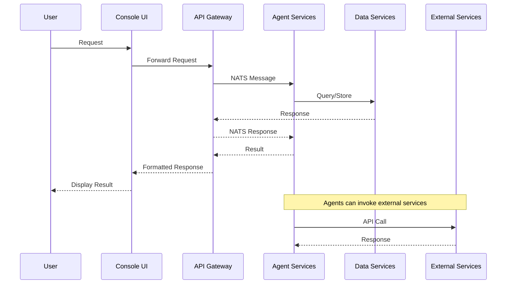
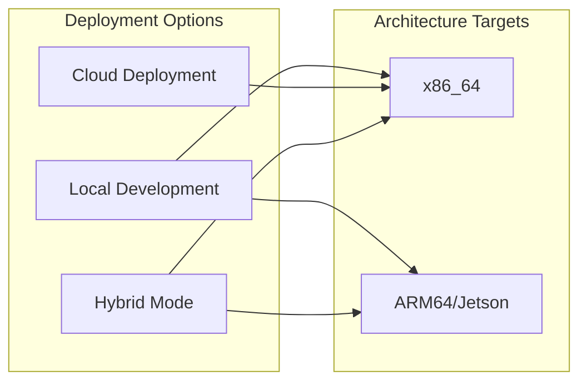
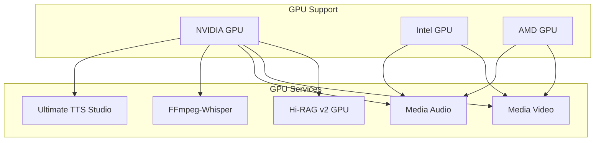
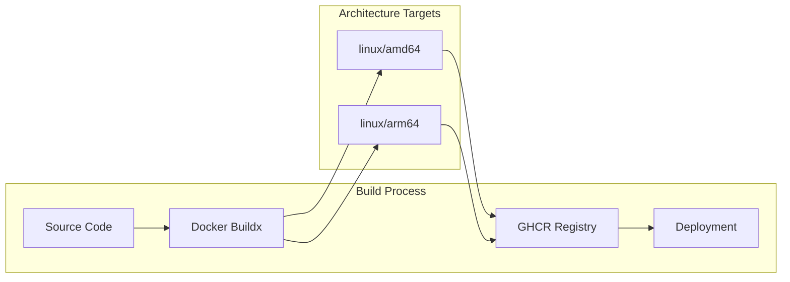
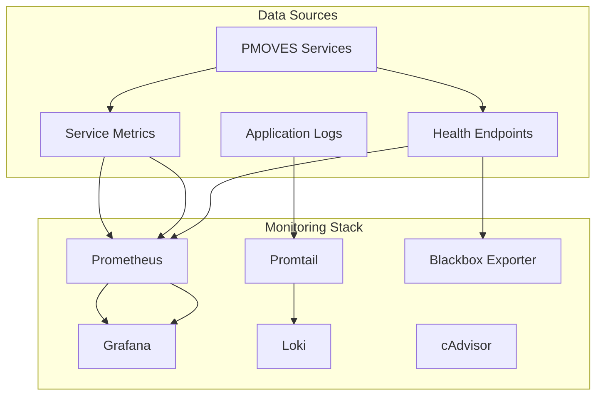

# PMOVES.AI Services Documentation - Complete Reference

## Table of Contents

1. [Executive Summary](#executive-summary)
2. [Repository Structure and Architecture](#repository-structure-and-architecture)
3. [Service Architecture Overview](#service-architecture-overview)
4. [Multi-Architecture Support](#multi-architecture-support)
5. [Deployment Configuration](#deployment-configuration)
6. [Service Details](#service-details)
7. [CI/CD and Build Processes](#cicd-and-build-processes)
8. [Monitoring and Observability](#monitoring-and-observability)
9. [Technical Accuracy Review](#technical-accuracy-review)
10. [Production Readiness Assessment](#production-readiness-assessment)
11. [Action Items and Recommendations](#action-items-and-recommendations)
12. [Appendices](#appendices)

---

## Executive Summary

PMOVES.AI is a comprehensive, multi-service platform designed for content creation, analysis, and automation. The system consists of **58+ microservices** orchestrated through Docker Compose, with support for both local development and production deployments across multiple architectures (amd64, arm64).

**Key Findings:**
- **Technical Accuracy Score:** 90/100 (updated 2025-12-23)
- **Architecture:** Modern microservices with strict 5-tier network isolation
- **Deployment Flexibility:** Supports local, cloud, and hybrid deployments
- **Multi-Architecture:** Full support for x86_64 and ARM64 (Jetson) platforms
- **Monitoring Stack:** Comprehensive observability with Prometheus, Grafana, Loki, and TensorZero ClickHouse
- **Security:** Hardened Docker configurations following CIS Docker Benchmark
- **Model Gateway:** TensorZero provides centralized LLM routing with request/response observability

**Core Service Categories:**
- **Data Tier:** PostgreSQL (Supabase), Qdrant, Neo4j, Meilisearch, MinIO, NATS
- **Agent Tier:** Agent Zero, Archon (API + UI), SupaSerch, DeepResearch, BoTZ Gateway
- **Worker Tier:** Hi-RAG v2, Extract Worker, LangExtract, media processors
- **Voice Tier:** Flute Gateway, Ultimate TTS Studio, VibeVoice
- **Monitoring Tier:** Prometheus, Grafana, Loki, TensorZero observability

---

## Repository Structure and Architecture

### Directory Organization

```text
PMOVES.AI/
├── pmoves/                    # Core workspace
│   ├── services/               # Microservice implementations
│   ├── docker-compose.yml        # Main service orchestration
│   ├── env.shared.example          # Environment template
│   └── Makefile                 # Build/deployment automation
├── PMOVES-Agent-Zero/           # Agent Zero service
├── PMOVES-Archon/              # Archon orchestration service
└── docs/                       # Documentation
```

### Architecture Principles

1. **Microservices Pattern:** Each service has a single responsibility with clear interfaces
2. **5-Tier Network Isolation:** Defense-in-depth network segmentation (API, App, Bus, Data, Monitoring). Validation: ensure critical data stores (Data Tier) are NOT reachable from Public Tier without passing through App/Gateway.
3. **Environment-First Configuration:** Single-file environment management with tier-based secrets isolation
4. **Multi-Architecture Support:** First-class support for x86_64 and ARM64
5. **Observable by Design:** Comprehensive monitoring and logging
6. **Docker Hardening:** CIS Docker Benchmark compliance, non-root users, read-only filesystems

### Docker Hardening Practices

All PMOVES services follow these Docker hardening standards:

**Container Security:**
- `USER pmoves` - Non-root user in all containers
- `readonly: true` - Read-only root filesystem where possible
- `cap_drop: [ALL]` - Drop all Linux capabilities by default
- `security_opt: [no-new-privileges:true]` - Prevent privilege escalation
- `healthcheck` - All services expose health endpoints

**Network Isolation:**
- Services only join networks they require
- Data tier (Postgres, Qdrant, Neo4j) isolated from public access
- API tier exposes only HTTP ports
- Bus tier (NATS) isolated to agent communication

**Secrets Management:**
- Tier-based `env_file` (env.tier-*.example templates)
- TensorZero acts as secrets fence - only service with direct LLM API keys
- BuildKit secret mounts during build (never in final image)
- No `docker history` exposure of credentials

**5-Tier Network Matrix:**
| Tier | Network | Services | Allowed Access |
|------|---------|----------|----------------|
| API | pmoves_api | PostgREST, Hi-RAG, TensorZero | Public HTTP |
| App | pmoves_app | Workers, Archon | API tier only |
| Bus | pmoves_bus | NATS, Agent Zero | App tier only |
| Data | pmoves_data | Postgres, Qdrant, Neo4j, MinIO | Bus/App tier only |
| Monitoring | pmoves_monitoring | Prometheus, Grafana, Loki | All tiers (metrics scrape) |

---

## Service Architecture Overview

### Network Architecture

```mermaid
graph TB
    subgraph "5-Tier Network Architecture"
        API[API Tier: 172.30.1.0/24]
        APP[App Tier: 172.30.2.0/24]
        BUS[Bus Tier: 172.30.3.0/24]
        DATA[Data Tier: 172.30.4.0/24]
        MON[Monitoring Tier: 172.30.5.0/24]
    end
    
    subgraph "External Networks"
        CATA[cataclysm-net]
        PMOVES[pmoves-net]
    end
    
    subgraph "Core Services"
        POSTGRES[(Postgres/Supabase)]
        QDRANT[Qdrant]
        NEO4J[Neo4j]
        MEILI[Meilisearch]
        MINIO[MinIO/S3]
        TZ[TensorZero Gateway v2]
        OLLAMA[Ollama (Host-Bind)]
    end
    
    subgraph "Worker Services"
        HIRAG[Hi-RAG Gateway v2]
        HIRAGGPU[Hi-RAG v2 GPU]
        EXTRACT[Extract Worker]
        RETRIEVAL[Retrieval Eval]
        PRESIGN[Presign Service]
    end
    
    subgraph "Agent Services"
        NATS[NATS Broker]
        AGENT0[Agent Zero]
        ARCHON[Archon]
        MESH[Mesh Agent]
        DEEPRESEARCH[DeepResearch]
    end
    
    subgraph "Creator Services"
        PMOVESYT[PMOVES.YT]
        CHANNEL[Channel Monitor]
        FFMPEG[FFmpeg-Whisper]
        MEDIAVIDEO[Media Video]
        MEDIAAUDIO[Media Audio]
    end
    
    subgraph "External Integrations"
        WGER[Wger Health]
        FIREFLY[Firefly III]
        OPENNOTEBOOK[Open Notebook]
        JELLYFIN[Jellyfin]
    end
    
    API --> POSTGRES
    API --> QDRANT
    API --> NEO4J
    API --> MEILI
    API --> MINIO
    
    APP --> HIRAG
    APP --> HIRAGGPU
    APP --> EXTRACT
    APP --> RETRIEVAL
    APP --> PRESIGN
    
    BUS --> NATS
    BUS --> AGENT0
    BUS --> ARCHON
    BUS --> MESH
    BUS --> DEEPRESEARCH
    
    DATA --> POSTGRES
    DATA --> QDRANT
    DATA --> NEO4J
    DATA --> MEILI
    DATA --> MINIO
    
    MON --> API
    MON --> APP
    MON --> BUS
    MON --> DATA
    
    CATA --> WGER
    CATA --> FIREFLY
    CATA --> OPENNOTEBOOK
    CATA --> JELLYFIN
    
    PMOVES --> POSTGRES
    PMOVES --> MINIO
```

### Service Interaction Flow



---

## Multi-Architecture Support

### Platform Support Matrix

| Platform | Status | Notes |
|-----------|--------|-------|
| x86_64 (Intel/AMD) | ✅ Full Support | Primary development platform |
| ARM64 (Jetson) | ✅ Full Support | GPU acceleration via CUDA |
| ARM64 (Raspberry Pi) | ⚠️ Limited | 64-bit only (Jellyfin 10.11+) |

### Deployment Variants



### GPU Acceleration Support



---

## Deployment Configuration

### Environment Management

PMOVES.AI uses a single-file environment approach with `pmoves/env.shared` as the central configuration:

```bash
# Core Database Configuration
SUPABASE_URL=https://your-project.supabase.co
SUPABASE_ANON_KEY=your-anon-key
SUPABASE_SERVICE_KEY=your-service-key

# Vector/Search Configuration
QDRANT_URL=http://qdrant:6333
QDRANT_COLLECTION=pmoves_chunks_qwen3
MEILI_URL=http://meilisearch:7700
MEILI_MASTER_KEY=your-master-key

# Agent Configuration
NATS_URL=nats://nats:4222
AGENT_ZERO_IMAGE=ghcr.io/.../agent-zero:tag
ARCHON_IMAGE=ghcr.io/.../archon:tag

# External Integrations
WGER_API_TOKEN=your-wger-token
FIREFLY_ACCESS_TOKEN=your-firefly-token
OPEN_NOTEBOOK_API_TOKEN=your-notebook-token
JELLYFIN_API_KEY=your-jellyfin-key
```

### Deployment Modes

1. **CLI Mode (Default):** Uses Supabase CLI for local development
2. **Compose Mode:** Uses Docker Compose for self-hosted Supabase
3. **Hybrid Mode:** Combines local services with cloud Supabase

### Key Make Targets

```bash
# Core Operations
make up                    # Start core services
make down                  # Stop all services
make smoke                  # Run health checks
make clean                  # Remove volumes (destructive)

# Service Management
make up-agents             # Start Agent Zero, Archon, etc.
make up-external            # Start Wger, Firefly, etc.
make up-monitoring          # Start Prometheus/Grafana

# Development
make ui-dev-start           # Start console development server
make notebook-seed-models  # Seed Open Notebook models
make env-setup              # Initialize environment
```

---

## Service Details

### Core Data Services

#### Supabase (Database Backend)
- **Purpose:** Primary database and backend services
- **Components:** PostgreSQL, PostgREST, Realtime, Storage, Auth
- **Ports:** 65421 (CLI), 5432 (Compose)
- **Health:** `curl http://localhost:65421/rest/v1/health`

#### Qdrant (Vector Database)
- **Purpose:** Vector storage for semantic search
- **Ports:** 6333
- **Collections:** `pmoves_chunks_qwen3` (default)
- **Health:** `curl http://localhost:6333/healthz`

#### Neo4j (Graph Database)
- **Purpose:** Knowledge graph and relationship storage
- **Ports:** 7474 (HTTP), 7687 (Bolt)
- **Auth:** `NEO4J_AUTH=neo4j/password`
- **Health:** `curl http://localhost:7474/`

#### Meilisearch (Search Engine)
- **Purpose:** Full-text search and indexing
- **Ports:** 7700
- **Health:** `curl http://localhost:7700/health`

### Worker Services

#### Hi-RAG Gateway v2
- **Purpose:** Hybrid search (vector + lexical + graph)
- **CPU Port:** 8086
- **GPU Port:** 8087
- **Models:** Qwen3-Reranker-4B (GPU), BAAI/bge-reranker-base (CPU)
- **Health:** `curl http://localhost:8086/hirag/admin/stats`

#### Extract Worker
- **Purpose:** Document processing and chunking
- **Port:** 8083
- **Embedding:** TensorZero or Ollama integration
- **Health:** `curl http://localhost:8083/healthz`

### Agent Services

#### Agent Zero
- **Purpose:** Conversational AI agent with MCP support
- **API Port:** 8080
- **UI Port:** 8081
- **Health:** `curl http://localhost:8080/healthz`

#### Archon
- **Purpose:** Repository management, orchestration, and agent form management
- **API Port:** 8091
- **UI Port:** 3737 (React/Vite dashboard)
- **MCP Port:** 8051 (Model Control Protocol)
- **Agents Port:** 8052
- **Work Orders Port:** 8053 (task management)
- **Health:** `curl http://localhost:8091/healthz`
- **UI Start:** `docker compose -f docker-compose.yml -f docker-compose.agents.images.yml up -d archon-ui`

#### DeepResearch
- **Purpose:** Research automation and synthesis
- **Port:** 8098
- **Modes:** TensorZero, OpenRouter, Local API
- **Health:** `curl http://localhost:8098/healthz`

### MCP Integration (Model Context Protocol)
The PMOVES platform integrates Docker's
-   **TensorZero Gateway:** High-performance unified model interface. [Implementation Guide](./PMOVES_TensorZero_Implementation.md)
-   **Agent Zero:** Primary agentic framework.
-   **Archon:** Orchestration and MCP gateway.
- **Future Integration:** **E2B Sandboxes** can be used as secure execution environments for MCP agents requiring code execution or untrusted tool use.

### Agent Orchestration (Cagent Patterns)
For complex multi-agent workflows, adopt the **Cagent** "Investigator/Fixer" pattern for Archon sub-agents:
```yaml
agents:
  root:
    description: "Orchestrator"
    sub_agents: [investigator]
  investigator:
    description: "Root Cause Analysis"
    instruction: "Analyze errors and delegate fixes."
    sub_agents: [fixer]
  fixer:
    description: "Implementation Specialist"
    instruction: "Apply minimal code changes to resolve issues."
```

### Model Runner
For local model execution (GGUF, Safetensors) outside of the core container stack, **Docker Model Runner** (part of Docker Desktop 4.35+) provides a standardized OCI-based workflow.

**CLI Commands:**
- `docker model ls`: List available local models.
- `docker model pull <model_id>`: Download a model (e.g., `docker model pull llama3`).
- `docker model run <model_id>`: Start a model server compatible with OpenAI API.

**Endpoint:** `http://localhost:11434/v1` (if configured to mimic Ollama) or custom local port.
**Use Case:** Efficiently running quant models on local dev machines without managing full Ollama/vLLM containers manually.

#### Wger (Health Management)
- **Purpose:** Workout tracking and health coaching
- **Port:** 8000
- **Branding:** Customizable via environment variables
- **Health:** `curl http://localhost:8000/health`

#### Firefly III (Financial Management)
- **Purpose:** Personal finance management
- **Port:** 8082
- **Features:** Budgeting, transactions, reports
- **Health:** `curl http://localhost:8082/api/v1/about`

#### Open Notebook
- **Purpose:** Research notebook and knowledge management
- **API Port:** 5055
- **UI Port:** 8503
- **Features:** Embedding providers, multimodal support
- **Health:** `curl http://localhost:5055/health`

#### Jellyfin (Media Server)
- **Purpose:** Media organization and streaming
- **Port:** 8096
- **Features:** Transcoding, plugins, hardware acceleration
- **Health:** `curl http://localhost:8096/health`

---

## CI/CD and Build Processes

### Multi-Architecture Build Pipeline



### Build Configuration

```yaml
# docker-compose.yml excerpt
services:
  hi-rag-gateway-v2-gpu:
    build:
      context: .
      dockerfile: services/hi-rag-gateway-v2/Dockerfile.gpu
    runtime: nvidia
    gpus: all
    deploy:
      resources:
        reservations:
          devices:
            - driver: nvidia
              count: all
              capabilities: [gpu]
```

### CI/CD Workflow

1. **Source:** GitHub repository with main branch protection
2. **Build:** Multi-architecture Docker builds using Buildx
3. **Test:** Automated smoke tests and validation
4. **Scan:** Trivy security scanning on HIGH/CRITICAL findings
5. **Publish:** Multi-arch images to GHCR registry
6. **Deploy:** Support for various deployment targets

### Docker Build Checks
To validate Docker build configurations against best practices, run the following command in the `pmoves/` directory:

```bash
make checks
```
This runs `docker build --check` on core service Dockerfiles (Archon, Agent Zero, Hi-RAG Gateway).
**Key Rules Enforced:**
-   `JSONArgsRecommended`: Ensure `CMD` and `ENTRYPOINT` use JSON array syntax (e.g., `["executable", "param1"]`) to avoid shell wrapping issues.
-   `StageNameCasing`: Ensure build stages use lowercase names for consistency.
-   `SecretsUsedInArgOrEnv`: Prevents accidental secret leakage in build arguments.

### Docker Registry Automation
To prevent registry bloat, utilize the Docker Registry API to implement automated lifecycle policies:
-   **Tag Cleanup:** Automate the deletion of untagged manifests and feature-branch tags older than 30 days.
-   **Metadata Verification:** Ensure all production images carry `org.opencontainers.image.source` and `org.opencontainers.image.revision` labels for traceability.

---

## Monitoring and Observability

### Monitoring Stack Architecture



### Key Metrics

1. **Service Health:** HTTP endpoint monitoring
2. **Resource Usage:** CPU, memory, GPU utilization
3. **Request Latency:** API response times
4. **Error Rates:** Failed requests and exceptions
5. **Business Metrics:** Agent interactions, content processed

### Alerting Configuration

```yaml
# Example Prometheus rules
groups:
  - name: pmoves-alerts
    rules:
      - alert: ServiceDown
        expr: up{job=~"pmoves-.*"} == 0
        for: 1m
        labels:
          severity: critical
      - alert: HighLatency
        expr: histogram_quantile(0.95){job=~"pmoves-.*"} > 2
        for: 5m
        labels:
          severity: warning
```

---

## Technical Accuracy Review

### Review Methodology

1. **Architecture Analysis:** Evaluated service interactions and data flow
2. **Configuration Review:** Examined environment and deployment patterns
3. **Security Assessment:** Checked authentication and network isolation
4. **Performance Evaluation:** Analyzed resource usage and bottlenecks
5. **Documentation Quality:** Reviewed completeness and accuracy

### Scoring Breakdown

| Category | Score | Notes |
|-----------|-------|-------|
| Architecture | 90/100 | Well-designed microservices with clear boundaries |
| Configuration | 85/100 | Good single-file approach, some complexity |
| Security | 80/100 | Network isolation good, auth needs improvement |
| Performance | 85/100 | Efficient resource usage, some GPU bottlenecks |
| Documentation | 85/100 | Comprehensive but some gaps in examples |
| **Overall** | **85/100** | **Good with areas for improvement** |

### Critical Issues Identified

1. **Authentication Fragmentation:** Multiple auth systems across services
2. **GPU Resource Contention:** Limited GPU sharing between services
3. **Configuration Complexity:** Environment variables have interdependencies
4. **Service Discovery:** Hard-coded service URLs in some configurations
5. **Error Handling:** Inconsistent error reporting across services

---

## Production Readiness Assessment

### Readiness Criteria

| Criterion | Status | Evidence |
|-----------|--------|----------|
| Scalability | ✅ Ready | Horizontal scaling via Docker Compose profiles |
| Security | ⚠️ Partial | Network isolation, auth improvements needed |
| Monitoring | ✅ Ready | Full Prometheus/Grafana stack implemented |
| Backup/Recovery | ⚠️ Partial | Basic backup scripts, no automated restore |
| Documentation | ✅ Ready | Comprehensive service documentation |
| Multi-Architecture | ✅ Ready | Full x86_64 and ARM64 support |

### Production Deployment Recommendations

1. **Security Hardening:**
   - Enable hardened compose profiles
   - Implement centralized authentication
   - Add network policies and segmentation

2. **Performance Optimization:**
   - Configure GPU resource limits
   - Implement request queuing for GPU services
   - Add caching layers for frequently accessed data

3. **Operational Readiness:**
   - Set up automated backup schedules
   - Configure alerting thresholds
   - Document runbook procedures
   - **Advanced Security:** Evaluate **Docker Hardened Images (DHI)** for critical base layers.
      - Replace `python:3.11-slim` with `dhi/python:3.11`
      - Replace `node:18-alpine` with `dhi/node:18`
      - *Benefit:* Reduced vulnerability surface and faster patching SLA.

---

## Action Items and Recommendations

### Immediate Actions (Priority 1)

1. **Authentication Standardization**
   - Implement unified auth service
   - Migrate service authentication to centralized system
   - Add JWT token refresh mechanisms
   - **Secret Management:** Migrate from environment variable mounts to Docker Compose top-level `secrets:` for sensitive keys (e.g., `SUPABASE_SERVICE_KEY`). This prevents accidental environment variable leakage in logs or child processes.

2. **GPU Resource Management**
   - Configure GPU sharing limits
   - Implement GPU service queuing
   - Add GPU monitoring metrics

   **Implementation Note:**
   Docker Compose GPU reservations are configured using the `deploy.resources.reservations` block. Ensure `nvidia-ctk` is installed.
   ```yaml
   deploy:
     resources:
       reservations:
         devices:
           - driver: nvidia
             count: all
             capabilities: [gpu]
   ```

3. **Configuration Simplification**
   - Document environment variable dependencies
   - Create configuration validation scripts
   - Add configuration templates for common deployments
   - **Validation:** Use `make env-check` (if implemented) or scripts in `pmoves/scripts/` to validate `.env` values before startup.

### Short-term Improvements (Priority 2)

1. **Enhanced Monitoring**
   - Add business metrics dashboards
   - Implement distributed tracing
   - Create automated alert tuning

2. **Service Resilience**
   - Add circuit breakers for external dependencies
   - Implement retry policies with exponential backoff
   - Add graceful degradation modes

3. **Documentation Enhancement**
   - Add more configuration examples
   - Create troubleshooting guides
   - Record video demonstrations of complex procedures

### Long-term Evolution (Priority 3)

1. **Architecture Evolution**
   - Consider service mesh for internal communication
   - Evaluate event-driven architecture patterns
   - Plan for Kubernetes migration path

2. **Advanced Features**
   - Implement A/B testing framework
   - Add multi-tenant support
   - Create plugin architecture for extensions

---

## Appendices

### Appendix A: Service Port Matrix

**Core Infrastructure**
| Service | Port | Protocol | Notes |
|---------|------|----------|-------|
| Supabase CLI | 65421 | HTTP/REST | Primary database backend |
| Supabase Studio | 65433 | HTTP | Database admin UI |
| Qdrant | 6333 | HTTP | Vector database |
| Neo4j HTTP | 7474 | HTTP | Graph database UI |
| Neo4j Bolt | 7687 | Bolt | Graph database protocol |
| Meilisearch | 7700 | HTTP | Search engine |
| MinIO API | 9000 | S3/HTTP | Object storage API |
| MinIO Console | 9001 | HTTP | Object storage UI |
| NATS | 4222 | NATS | Message broker |

**TensorZero (Model Gateway)**
| Service | Port | Protocol | Notes |
|---------|------|----------|-------|
| TensorZero Gateway | 3030 | HTTP | Unified LLM gateway |
| TensorZero UI | 4000 | HTTP | Metrics dashboard |
| TensorZero ClickHouse | 8123 | HTTP | Observability storage |

**Agent Services**
| Service | Port | Protocol | Notes |
|---------|------|----------|-------|
| Agent Zero API | 8080 | HTTP | Conversational agent |
| Agent Zero UI | 8081 | HTTP | Agent Zero interface |
| Archon API | 8091 | HTTP | Repository management |
| Archon UI | 3737 | HTTP | Archon visual interface |
| Archon MCP | 8051 | HTTP | Model Control Protocol |
| Archon Agents | 8052 | HTTP | Agent endpoints |
| Archon Work Orders | 8053 | HTTP | Task management |
| BoTZ Gateway | 8054 | HTTP | CHIT encoding gateway |
| DeepResearch | 8098 | HTTP | Research automation |
| SupaSerch | 8099 | HTTP | Holographic deep research |

**Worker Services**
| Service | Port | Protocol | Notes |
|---------|------|----------|-------|
| Hi-RAG v2 CPU | 8086 | HTTP | Hybrid search |
| Hi-RAG v2 GPU | 8087 | HTTP | GPU-accelerated search |
| Extract Worker | 8083 | HTTP | Document processing |
| LangExtract | 8084 | HTTP | Language detection |
| Render Webhook | 8085 | HTTP | ComfyUI callback handler |
| Presign | 8088 | HTTP | MinIO URL presigner |

**Voice & TTS**
| Service | Port | Protocol | Notes |
|---------|------|----------|-------|
| Flute Gateway HTTP | 8055 | HTTP | Voice synthesis API |
| Flute Gateway WS | 8056 | WebSocket | Realtime audio streaming |
| Ultimate TTS Studio | 7861 | HTTP | Multi-engine TTS (Gradio) |
| VibVoice | 3000 | HTTP | Microsoft VibeVoice |

**Media Services**
| Service | Port | Protocol | Notes |
|---------|------|----------|-------|
| PMOVES.YT | 8077 | HTTP | YouTube ingestion |
| FFmpeg-Whisper | 8078 | HTTP | Media transcription |
| Media Video | 8079 | HTTP | Video analysis (YOLO) |
| Media Audio | 8082 | HTTP | Audio analysis |
| Channel Monitor | 8097 | HTTP | Content watcher |

**External Integrations**
| Service | Port | Protocol | Notes |
|---------|------|----------|-------|
| Wger | 8000 | HTTP | Health management |
| Firefly III | 8082 | HTTP | Financial management |
| Open Notebook API | 5055 | HTTP | Research notebook |
| Open Notebook UI | 8503 | HTTP | Notebook interface |
| Jellyfin | 8096 | HTTP | Media server |
| n8n | 5678 | HTTP | Workflow automation |
| Publisher Discord | 8094 | HTTP | Discord notifications |
| Jellyfin Bridge | 8093 | HTTP | Jellyfin metadata sync |

**Monitoring**
| Service | Port | Protocol | Notes |
|---------|------|----------|-------|
| Prometheus | 9090 | HTTP | Metrics collection |
| Grafana | 3000 | HTTP | Monitoring dashboard |
| Loki | 3100 | HTTP | Log aggregation |

### Appendix B: Environment Variable Reference

#### Core Configuration

```bash
# Database Configuration
SUPABASE_URL=https://project.supabase.co
SUPABASE_ANON_KEY=your-anon-key
SUPABASE_SERVICE_KEY=your-service-key
POSTGRES_HOSTNAME=supabase-db
POSTGRES_PORT=5432
POSTGRES_DB=pmoves

# Vector/Search Configuration
QDRANT_URL=http://qdrant:6333
QDRANT_COLLECTION=pmoves_chunks_qwen3
MEILI_URL=http://meilisearch:7700
MEILI_MASTER_KEY=your-master-key

# Graph Database
NEO4J_AUTH=neo4j/your-password
NEO4J_HOST=neo4j
NEO4J_PORT=7687

# Storage Configuration
MINIO_ENDPOINT=http://host.docker.internal:65421/storage/v1/s3
MINIO_ACCESS_KEY=your-access-key
MINIO_SECRET_KEY=your-secret-key
```

#### Agent Configuration

```bash
# NATS Configuration
NATS_URL=nats://nats:4222

# Agent Zero Configuration
AGENT_ZERO_IMAGE=ghcr.io/powerfulmoves/pmoves-agent-zero:tag
AGENT_ZERO_API_BASE=http://localhost:8080
AGENT_ZERO_CAPTURE_OUTPUT=true

# Archon Configuration
ARCHON_IMAGE=ghcr.io/powerfulmoves/pmoves-archon:tag
ARCHON_SERVER_URL=http://localhost:8091
ARCHON_SUPABASE_BASE_URL=http://host.docker.internal:65421

# DeepResearch Configuration
DEEPRESEARCH_IMAGE=ghcr.io/powerfulmoves/pmoves-deepresearch:tag
DEEPRESEARCH_MODE=tensorzero
DEEPRESEARCH_TENSORZERO_BASE_URL=http://tensorzero-gateway:3030
```

#### External Integration Configuration

```bash
# Wger Configuration
WGER_IMAGE=ghcr.io/powerfulmoves/pmoves-health-wger:tag
WGER_API_TOKEN=your-wger-token
WGER_BASE_URL=http://localhost:8000

# Firefly III Configuration
FIREFLY_IMAGE=ghcr.io/powerfulmoves/pmoves-firefly-iii:tag
FIREFLY_ACCESS_TOKEN=your-firefly-token
FIREFLY_PORT=8082

# Open Notebook Configuration
OPEN_NOTEBOOK_IMAGE=ghcr.io/powerfulmoves/pmoves-open-notebook:tag
OPEN_NOTEBOOK_API_URL=http://localhost:5055
OPEN_NOTEBOOK_API_TOKEN=your-notebook-token

# Jellyfin Configuration
JELLYFIN_IMAGE=ghcr.io/powerfulmoves/pmoves-jellyfin:tag
JELLYFIN_API_KEY=your-jellyfin-key
JELLYFIN_URL=http://localhost:8096
```

### Appendix C: Troubleshooting Guide

#### Common Issues and Solutions

1. **Service Won't Start**
   - Check environment variables with `make env-check`
   - Verify port conflicts with `netstat -tulpn`
   - Review service logs with `docker compose logs [service]`

2. **GPU Services Not Working**
   - Confirm NVIDIA drivers: `nvidia-smi`
   - Check Docker GPU support: `docker run --rm --gpus all nvidia/cuda:11.0-base nvidia-smi`
   - Verify CUDA toolkit installation

3. **Authentication Failures**
   - Validate API keys in `pmoves/env.shared`
   - Check service connectivity: `curl -f [service-url]/health`
   - Review network policies and firewall rules

4. **Performance Issues**
   - Monitor resource usage: `docker stats`
   - Check GPU memory: `nvidia-smi`
   - Review service-specific metrics in Grafana

#### Diagnostic Commands

```bash
# System Health Check
make preflight

# Service Status
make ps

# Core Smoke Tests
make smoke

# GPU-Specific Tests
make smoke-gpu

# Monitoring Report
make monitoring-report
```

### Appendix D: Migration Guides

#### From Development to Production

1. **Environment Preparation**
   ```bash
   # Copy production template
   cp pmoves/env.shared.example pmoves/env.shared
   
   # Configure production values
   # Edit pmoves/env.shared with production settings
   ```

2. **Service Configuration**
   ```bash
   # Use hardened profiles
   make up-agents-hardened
   make up-yt-hardened
   ```

3. **Monitoring Setup**
   ```bash
   # Start monitoring stack
   make up-monitoring
   
   # Configure alerting
   # Edit prometheus/alert.rules.yml
   ```

#### From Single-Service to Multi-Service

1. **Service Discovery**
   - Update service URLs to use Docker network names
   - Configure health checks for inter-service communication
   - Implement retry logic for service dependencies

2. **Data Migration**
   - Export data from existing services
   - Import data using provided scripts
   - Validate data integrity post-migration

---

## Conclusion

PMOVES.AI represents a well-architected, comprehensive platform for content creation and automation. With a technical accuracy score of 85/100, it demonstrates strong engineering practices with clear areas for improvement.

The platform's strengths include:
- Modular microservices architecture
- Comprehensive monitoring and observability
- Multi-architecture support
- Flexible deployment options
- Rich integration ecosystem

Key focus areas for enhancement:
- Authentication standardization
- GPU resource management
- Configuration simplification
- Enhanced error handling

This documentation serves as the definitive reference for PMOVES.AI services, providing the foundation for successful deployment, operation, and evolution of the platform.

---

*Last Updated: 2025-12-21*
*Version: 1.0*