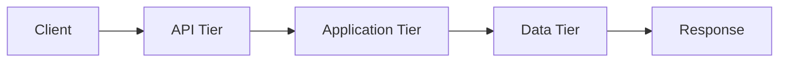
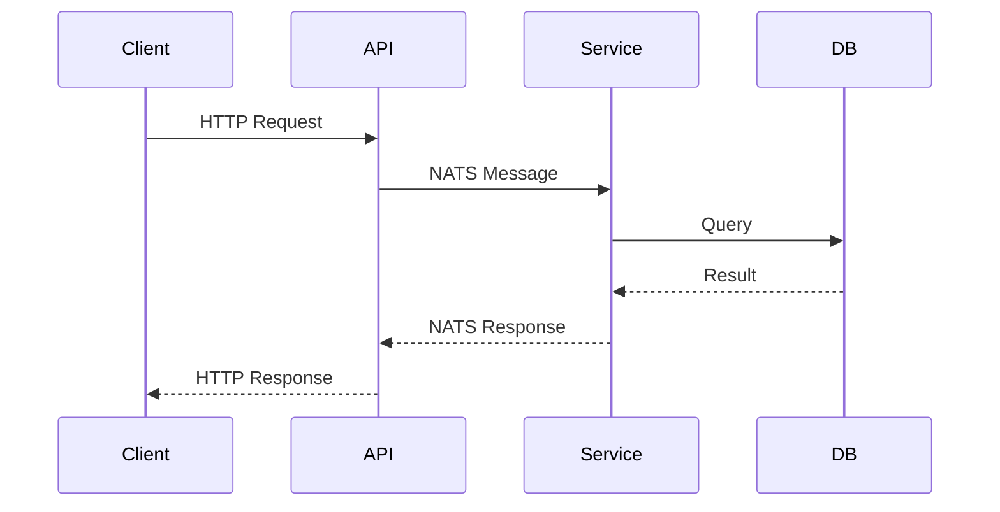
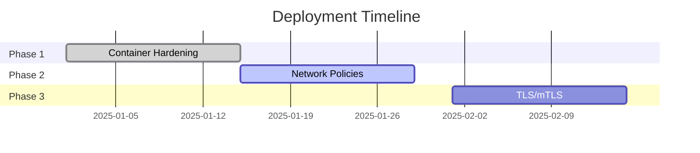

# PMOVES.AI Documentation Template - Quick Reference

**Last Updated:** 2026-01-29
**Template Version:** 1.0.0

---

## How to Use This Template

### Step 1: Copy the Template
```bash
cp /home/pmoves/PMOVES.AI/docs/templates/STANDARD-DOCUMENTATION-TEMPLATE.md \
   /home/pmoves/PMOVES.AI/docs/your-service-name.md
```

### Step 2: Update Document Metadata
```markdown
**Document Type:** [Architecture/Security/Operations/Development/Testing]
**Status:** [Draft/Under Review/Approved/Implemented/Deprecated]
**Version:** 1.0.0
**Last Updated:** 2026-01-29
**Author:** [Your Name]
**Review Cycle:** [Monthly/Quarterly/Annually/As-needed]
```

### Step 3: Fill in Executive Summary
- 2-3 paragraphs overview
- Key objectives (bullet points)
- Target audience

### Step 4: Customize Sections
- Keep: Architecture, Security, Implementation (most documents)
- Optional: Testing, Operations, Troubleshooting (as needed)
- Remove: Sections not relevant to your document

### Step 5: Update All Links
- Replace `#link` with actual document paths
- Use absolute paths: `/home/pmoves/PMOVES.AI/docs/...`
- Verify links work before committing

---

## Section Checklist

### Required Sections (All Documents)
- [x] Header with metadata (Document Type, Status, Version, Date)
- [x] Executive Summary (overview, objectives, audience)
- [x] Related Documentation (internal and external links)
- [x] Appendices (configuration examples, change history)

### Service Documentation
- [x] Architecture Overview (tier assignment, dependencies, data flow)
- [x] Security Considerations (container hardening, secrets, network policies)
- [x] Implementation Guide (deployment steps, configuration reference)
- [x] Testing & Validation (pre-commit, pre-PR, integration tests)
- [x] Operations & Maintenance (monitoring, logging, backups)
- [x] Troubleshooting (common issues, debug mode)

### Process Documentation
- [x] Process Overview (purpose, scope, stakeholders)
- [x] Workflow Diagrams (Mermaid format)
- [x] Step-by-Step Instructions (code blocks with expected output)
- [x] Validation Criteria (checklist format)
- [x] Rollback Procedures (emergency recovery steps)

### Security Documentation
- [x] Threat Model (attack vectors, mitigations)
- [x] Security Controls Matrix (technical safeguards)
- [x] Compliance Mapping (CIS, NIST, PCI DSS, SOC 2)
- [x] Audit Checklist (review criteria)
- [x] Incident Response (escalation, remediation)

---

## Code Block Patterns

### Docker Compose
```yaml
# Service with security hardening
services:
  service-name:
    user: "65532:65532"           # Non-root user
    security_opt:
      - no-new-privileges:true    # Prevent escalation
    cap_drop:
      - ALL                       # Drop capabilities
    read_only: true               # Read-only rootfs
    tmpfs:
      - /tmp:size=500M           # Writable temp
      - /home/pmoves/.cache:size=1G  # Cache
    networks:
      - api_tier                  # External access
      - app_tier                  # Internal logic
      - monitoring_tier           # Metrics
```

### Dockerfile
```dockerfile
# Standard non-root pattern
FROM python:3.11-slim

# Create non-root user
RUN groupadd -r pmoves -g 65532 && \
    useradd -r -u 65532 -g pmoves -s /sbin/nologin \
    -c "PMOVES Service" pmoves && \
    mkdir -p /app /data && \
    chown -R pmoves:pmoves /app /data

# Install dependencies (as root)
COPY requirements.txt /app/
RUN pip install --no-cache-dir -r /app/requirements.txt

# Copy application (set ownership)
COPY --chown=pmoves:pmoves . /app/
WORKDIR /app

# Drop to non-root user
USER pmoves:pmoves

# Health check
HEALTHCHECK --interval=30s --timeout=10s \
  CMD curl -f http://localhost:8080/healthz || exit 1

ENTRYPOINT ["python", "-u", "main.py"]
```

### Kubernetes NetworkPolicy
```yaml
apiVersion: networking.k8s.io/v1
kind: NetworkPolicy
metadata:
  name: service-name-policy
spec:
  podSelector:
    matchLabels:
      app: service-name
  policyTypes: [Ingress, Egress]

  ingress:
  - from:
    - podSelector:
        matchLabels:
          tier: api
    ports:
    - protocol: TCP
      port: 8080

  egress:
  - to:
    - podSelector:
        matchLabels:
          tier: data
    ports:
    - protocol: TCP
      port: 5432
```

### GitHub Actions (Harden-Runner)
```yaml
- name: Harden Runner
  uses: step-security/harden-runner@v2
  with:
    egress-policy: audit  # Start with audit
    disable-sudo: true
    allowed-endpoints: >
      github.com:443
      ghcr.io:443
      registry-1.docker.io:443
```

---

## Table Patterns

### Service Communication
| From Service | To Service | Protocol | Port | Purpose |
|-------------|-----------|----------|------|---------|
| agent-zero | hi-rag-gateway-v2 | HTTP/REST | 8086 | Knowledge retrieval |
| extract-worker | qdrant | HTTP/gRPC | 6333 | Vector storage |

### Environment Variables
| Variable | Required | Default | Description |
|----------|----------|---------|-------------|
| SERVICE_PORT | Yes | 8080 | HTTP API port |
| LOG_LEVEL | No | INFO | Logging level |
| MAX_WORKERS | No | 4 | Worker threads |

### CI/CD Requirements
| Check | Status | Requirement |
|-------|--------|-------------|
| CodeQL | ✅/❌ | Must pass |
| Trivy | ✅/❌ | Zero CRITICAL CVEs |
| CodeRabbit | ✅/❌ | Docstrings ≥80% |

---

## Network Tier Reference

### 5-Tier Architecture
1. **API Tier** (172.30.1.0/24) - Public-facing services
2. **Application Tier** (172.30.2.0/24) - Internal logic (internal: true)
3. **Bus Tier** (172.30.3.0/24) - NATS message bus (internal: true)
4. **Data Tier** (172.30.4.0/24) - Databases/storage (internal: true)
5. **Monitoring Tier** (172.30.5.0/24) - Observability

### Service Tier Assignment
```yaml
services:
  # Multi-tier service (common pattern)
  agent-zero:
    networks:
      - api_tier       # External API (8080)
      - app_tier       # Internal services
      - bus_tier       # NATS pub/sub
      - monitoring_tier # /metrics

  # Single-tier service (rare)
  postgres:
    networks:
      - data_tier      # Database only
      - monitoring_tier # /metrics
```

---

## Security Controls Checklist

### Container Hardening
- [ ] Non-root user (UID 65532:65532)
- [ ] Read-only root filesystem
- [ ] Tmpfs mounts (/tmp, /home/pmoves/.cache)
- [ ] Capability drop (`cap_drop: ["ALL"]`)
- [ ] No privilege escalation (`no-new-privileges: true`)
- [ ] Minimal base image (prefer distroless)

### Network Security
- [ ] Network tier assignment correct
- [ ] Internal networks marked `internal: true`
- [ ] NetworkPolicy for Kubernetes (default-deny + explicit allow)
- [ ] No legacy network (`pmoves-net`)

### Secrets Management
- [ ] No hardcoded secrets in code/env files
- [ ] Secrets in Vault/ExternalSecrets
- [ ] Rotation schedule defined (90 days API keys, 30 days internal)
- [ ] Secret access audit trail

### CI/CD Security
- [ ] Harden-Runner enabled
- [ ] Actions pinned to SHA256
- [ ] Trivy scanning for CVEs
- [ ] SLSA provenance attestation
- [ ] CodeQL analysis passing

---

## Diagram Patterns (Mermaid)

### Flowchart


### Sequence Diagram


### Gantt Chart


---

## Compliance Mapping

### Standards Coverage
- ✅ **CIS Docker Benchmark 5.3:** Container runtime security
- ✅ **NIST 800-190:** Container security guidelines
- ✅ **Kubernetes Pod Security Standards:** Restricted profile
- ✅ **PCI DSS 1.3:** Network segmentation
- ✅ **SOC 2 CC6.6:** Logical access controls

### Compliance Statement Template
```markdown
## Compliance Alignment

This implementation meets the following standards:

- ✅ **CIS Docker Benchmark 5.3:**
  - 5.2: Containers run as non-root (implemented)
  - 5.12: Read-only root filesystem (implemented)
  - 5.25: No privilege escalation (implemented)

- ✅ **NIST 800-190:**
  - Image and registry security (non-root user)
  - Runtime security (read-only, capabilities drop)
  - Host security (future phase)

- ✅ **Kubernetes Pod Security Standards:**
  - runAsNonRoot: true
  - readOnlyRootFilesystem: true
  - allowPrivilegeEscalation: false
  - capabilities.drop: ALL
```

---

## Common Commands

### Service Health
```bash
# Check health endpoint
curl -f http://localhost:8080/healthz

# Check all services
make verify-all

# Check specific tier
docker network inspect pmoves_api --format '{{len .Containers}}'
```

### Service Logs
```bash
# Docker Compose
docker compose logs -f service-name

# Kubernetes
kubectl logs -f deployment/service-name -n pmoves-prod

# Loki query
{service="service-name"} |= "error"
```

### Service Metrics
```bash
# Prometheus query
curl http://localhost:9090/api/v1/query?query=up{job="service-name"}

# Service metrics
curl http://localhost:8080/metrics
```

---

## Link Patterns

### Internal Documentation
```markdown
- [Network Tier Segmentation](/home/pmoves/PMOVES.AI/docs/architecture/network-tier-segmentation.md)
- [Testing Strategy](/home/pmoves/PMOVES.AI/.claude/context/testing-strategy.md)
- [Services Catalog](/home/pmoves/PMOVES.AI/.claude/context/services-catalog.md)
- [NATS Subjects](/home/pmoves/PMOVES.AI/.claude/context/nats-subjects.md)
```

### External References
```markdown
- [CIS Docker Benchmark](https://www.cisecurity.org/benchmark/docker)
- [NIST SP 800-190](https://nvlpubs.nist.gov/nistpubs/SpecialPublications/NIST.SP.800-190.pdf)
- [Kubernetes Pod Security Standards](https://kubernetes.io/docs/concepts/security/pod-security-standards/)
```

---

## Version Tracking

### Semantic Versioning
- **Major (X):** Breaking changes, complete rewrites
- **Minor (Y):** New sections, significant additions
- **Patch (Z):** Typos, minor clarifications

### Change History Table
| Version | Date | Author | Changes |
|---------|------|--------|---------|
| 1.0.0 | 2026-01-29 | PMOVES.AI Team | Initial version |
| 1.1.0 | YYYY-MM-DD | Name | Added section X |

---

## Review Workflow

### Self-Review Checklist
- [ ] All sections complete
- [ ] Code blocks tested and accurate
- [ ] Links verified (internal and external)
- [ ] Tables formatted correctly
- [ ] Diagrams render properly
- [ ] Compliance section complete
- [ ] Version updated
- [ ] Metadata accurate

### Peer Review Request
```markdown
## Review Request

**Document:** [Link to document]
**Type:** [Architecture/Security/Operations/etc]
**Status:** Ready for Review

**Key Changes:**
- [Change 1]
- [Change 2]

**Review Focus:**
- Technical accuracy
- Completeness of sections
- Clarity of instructions
- Compliance alignment
```

---

## Tips & Best Practices

### Writing Style
- Use present tense ("Service does X", not "Service will do X")
- Be concise (bullet points over paragraphs)
- Use active voice ("Deploy the service" not "The service is deployed")
- Define acronyms on first use

### Code Examples
- Include command purpose in comment
- Show expected output
- Highlight important flags/options
- Test all commands before documenting

### Diagrams
- Keep diagrams simple (max 10-15 nodes)
- Use consistent styling
- Add legends for complex diagrams
- Verify rendering in GitHub

### Tables
- Keep tables narrow (max 5-6 columns)
- Use abbreviations consistently
- Sort data logically (alphabetical, numerical)
- Include units in headers

---

## Template Files

### Main Template
**Path:** `/home/pmoves/PMOVES.AI/docs/templates/STANDARD-DOCUMENTATION-TEMPLATE.md`
**Purpose:** Full template with all sections

### Quick Reference
**Path:** `/home/pmoves/PMOVES.AI/docs/templates/QUICK-REFERENCE.md`
**Purpose:** This file - quick lookup guide

### Decisions Document
**Path:** `/home/pmoves/PMOVES.AI/docs/templates/TEMPLATE-DECISIONS.md`
**Purpose:** Rationale behind standardization decisions

---

**Quick Reference Version:** 1.0.0
**Last Updated:** 2026-01-29
**Maintainer:** PMOVES.AI Documentation Team
