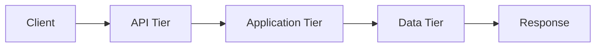

# PMOVES.AI Standard Documentation Template

**Document Type:** [Architecture/Security/Operations/Development/Testing]
**Status:** [Draft/Under Review/Approved/Implemented/Deprecated]
**Version:** X.Y.Z
**Last Updated:** YYYY-MM-DD
**Author:** PMOVES.AI Team
**Review Cycle:** [Monthly/Quarterly/Annually/As-needed]

---

## Executive Summary

[Brief 2-3 paragraph overview of what this document covers, its purpose, and key outcomes]

**Key Objectives:**
- [Objective 1]
- [Objective 2]
- [Objective 3]

**Target Audience:**
- [Role 1 - what they need from this doc]
- [Role 2 - what they need from this doc]

---

## Table of Contents

- [Executive Summary](#executive-summary)
- [Architecture Overview](#architecture-overview)
- [Security Considerations](#security-considerations)
- [Implementation Guide](#implementation-guide)
- [Testing & Validation](#testing--validation)
- [Operations & Maintenance](#operations--maintenance)
- [Troubleshooting](#troubleshooting)
- [Related Documentation](#related-documentation)
- [Appendices](#appendices)

---

## Architecture Overview

### System Context

**PMOVES.AI Integration Point:** [Describe how this component fits into the overall platform]

**Tier Assignment:** [API/Application/Bus/Data/Monitoring Tier]

**Network Segmentation:**
```yaml
# Example: Network tier configuration
networks:
  api_tier:
    driver: bridge
    name: pmoves_api
    ipam:
      config:
        - subnet: 172.30.1.0/24

service-name:
  networks:
    - api_tier       # External access
    - app_tier       # Internal logic
    - monitoring_tier # Metrics exposure
```

### Component Architecture

**Primary Service:** [Service Name]
**Dependencies:** [List upstream services this depends on]
**Dependents:** [List downstream services that depend on this]

**Communication Pattern:**
| From Service | To Service | Protocol | Port | Purpose |
|-------------|-----------|----------|------|---------|
| service-a | service-b | HTTP/REST | 8080 | API calls |
| service-c | NATS | NATS/JS | 4222 | Event pub/sub |

### Data Flow



**Critical Data Paths:**
1. **Path 1:** [Description]
2. **Path 2:** [Description]

---

## Security Considerations

### Container Security

**Dockerfile Hardening:**
```dockerfile
# Non-root user pattern (REQUIRED)
FROM python:3.11-slim

# Create non-root user
RUN groupadd -r pmoves -g 65532 && \
    useradd -r -u 65532 -g pmoves -s /sbin/nologin -c "PMOVES Service" pmoves && \
    mkdir -p /app /data && \
    chown -R pmoves:pmoves /app /data

# Install dependencies as root
COPY requirements.txt /app/
RUN pip install --no-cache-dir -r /app/requirements.txt

# Copy application and set ownership
COPY --chown=pmoves:pmoves . /app/
WORKDIR /app

# Drop to non-root user
USER pmoves:pmoves

# Health check
HEALTHCHECK --interval=30s --timeout=10s --start-period=5s --retries=3 \
  CMD curl -f http://localhost:8080/healthz || exit 1

ENTRYPOINT ["python", "-u", "main.py"]
```

**Security Controls Checklist:**
- [ ] Non-root user (UID 65532:65532)
- [ ] Read-only root filesystem
- [ ] Tmpfs mounts for writable paths
- [ ] Capability drops (`cap_drop: ["ALL"]`)
- [ ] No privilege escalation (`no-new-privileges: true`)
- [ ] Minimal base image (prefer distroless)

### Secrets Management

**Secret Types:**
| Secret | Type | Rotation | Storage Location |
|--------|------|----------|------------------|
| API_KEY | External | 90 days | Vault/ExternalSecret |
| WEBHOOK_SECRET | Internal | 30 days | Vault/ExternalSecret |

**Secret Usage Pattern:**
```yaml
# docker-compose.yml
services:
  service-name:
    environment:
      - API_KEY_FILE=/run/secrets/api_key
    secrets:
      - api_key

secrets:
  api_key:
    external: true
    name: pmoves-prod/service-name-api-key
```

**Secret Rotation:**
- Automated rotation via CronJob: [Link to rotation job]
- Manual rotation trigger: [Command/script]
- Rotation verification: [Health check endpoint]

### Network Security

**Network Policies:**
```yaml
# Kubernetes NetworkPolicy example
apiVersion: networking.k8s.io/v1
kind: NetworkPolicy
metadata:
  name: service-name-policy
spec:
  podSelector:
    matchLabels:
      app: service-name
  policyTypes:
  - Ingress
  - Egress

  ingress:
  - from:
    - podSelector:
        matchLabels:
          tier: api
    ports:
    - protocol: TCP
      port: 8080

  egress:
  - to:
    - podSelector:
        matchLabels:
          tier: data
    ports:
    - protocol: TCP
      port: 5432
```

**Allowed Communication:**
- **Ingress:** [List allowed sources]
- **Egress:** [List allowed destinations]

### Access Control

**Authentication:**
- Method: [JWT/API Key/mTLS]
- Issuer: [Identity provider]
- Validation: [Where auth is validated]

**Authorization:**
- Model: [RBAC/ABAC/ACL]
- Permissions: [Permission matrix]

---

## Implementation Guide

### Prerequisites

**Environment Requirements:**
- Hardware: [CPU/RAM/GPU requirements]
- Software: [Required dependencies]
- Network: [Required connectivity]

**Pre-Deployment Checklist:**
- [ ] Environment variables configured
- [ ] Secrets created and accessible
- [ ] Network policies applied
- [ ] Dependencies healthy
- [ ] Volume mounts prepared

### Deployment Steps

#### Step 1: Preparation
```bash
# Clone repository
git clone https://github.com/PMOVES/PMOVES.AI.git
cd PMOVES.AI

# Checkout correct branch
git checkout PMOVES.AI-Edition-Hardened

# Initialize submodules
git submodule update --init --recursive
```

#### Step 2: Configuration
```bash
# Copy environment template
cp pmoves/env.shared.example pmoves/env.shared

# Generate secrets
./pmoves/scripts/generate-secrets.sh

# Edit configuration
nano pmoves/env.shared
```

#### Step 3: Build
```bash
# Build service image
docker build -t ghcr.io/pmoves/service-name:edge \
  -f pmoves/services/service-name/Dockerfile \
  pmoves/services/service-name/

# Verify image
docker images | grep service-name
```

#### Step 4: Deploy
```bash
# Docker Compose deployment
cd pmoves
docker compose -f docker-compose.yml \
  -f docker-compose.hardened.yml \
  --profile <profile-name> \
  up -d service-name

# Kubernetes deployment
kubectl apply -f deploy/k8s/base/deployments/service-name.yaml
kubectl apply -f deploy/k8s/overlays/prod/
```

#### Step 5: Verification
```bash
# Check service health
curl -f http://localhost:8080/healthz

# Check logs
docker compose logs -f service-name

# Check metrics
curl http://localhost:8080/metrics
```

### Configuration Reference

**Environment Variables:**
| Variable | Required | Default | Description |
|----------|----------|---------|-------------|
| SERVICE_PORT | Yes | 8080 | HTTP API port |
| API_KEY | Yes | - | External API key |
| LOG_LEVEL | No | INFO | Logging level |
| MAX_WORKERS | No | 4 | Worker thread count |

**Volume Mounts:**
| Volume | Path | Purpose |
|--------|------|---------|
| data-volume | /data | Persistent data |
| cache-volume | /home/pmoves/.cache | Application cache |

**Resource Limits:**
```yaml
# Docker Compose
services:
  service-name:
    deploy:
      resources:
        limits:
          cpus: '2.0'
          memory: 4G
        reservations:
          cpus: '1.0'
          memory: 2G

# Kubernetes
resources:
  requests:
    cpu: "1"
    memory: "2Gi"
  limits:
    cpu: "2"
    memory: "4Gi"
```

---

## Testing & Validation

### Pre-Commit Testing

**Developer Workflow:**
```bash
# Run unit tests
pytest pmoves/services/service-name/tests/ -v

# Lint Python code
ruff check --fix pmoves/services/service-name/

# Type check
mypy pmoves/services/service-name/
```

### Pre-PR Testing

**Full Validation Suite:**
```bash
# Run all smoke tests
cd pmoves && make verify-all

# Service-specific tests
pytest pmoves/services/service-name/tests/ -v

# Health check
curl -f http://localhost:8080/healthz
```

**CI/CD Requirements:**
| Check | Status | Requirement |
|-------|--------|-------------|
| CodeQL Analysis | ✅/❌ | Must pass |
| CHIT Contract Check | ✅/❌ | Must pass |
| SQL Policy Lint | ✅/❌ | Must pass |
| CodeRabbit Review | ✅/❌ | Docstring coverage ≥80% |
| Trivy Scan | ✅/❌ | Zero CRITICAL CVEs |

### Integration Testing

**Test Scenarios:**
1. **Scenario 1:** [Description]
   - Setup: [How to prepare]
   - Execution: [Commands to run]
   - Expected: [Expected outcome]

2. **Scenario 2:** [Description]
   - Setup: [How to prepare]
   - Execution: [Commands to run]
   - Expected: [Expected outcome]

### Performance Testing

**Benchmarks:**
| Metric | Target | Actual | Status |
|--------|--------|--------|--------|
| Request Latency (p50) | <100ms | [value] | ✅/❌ |
| Request Latency (p99) | <500ms | [value] | ✅/❌ |
| Throughput | >1000 req/s | [value] | ✅/❌ |
| Memory Usage | <4Gi | [value] | ✅/❌ |

---

## Operations & Maintenance

### Monitoring

**Metrics Exposed:**
```promql
# Example Prometheus queries
# Request rate
rate(http_requests_total{service="service-name"}[5m])

# Error rate
rate(http_errors_total{service="service-name"}[5m])

# Latency
histogram_quantile(0.99, rate(http_request_duration_seconds_bucket{service="service-name"}[5m]))
```

**Dashboards:**
- Grafana Dashboard: [Link to dashboard]
- Key Panels: [List important panels]

**Alerting:**
| Alert | Condition | Severity | Action |
|-------|-----------|----------|--------|
| High Error Rate | error_rate > 5% | Critical | PagerDuty |
| High Latency | p99_latency > 1s | Warning | Slack notification |
| Pod Not Ready | up == 0 | Critical | Auto-restart |

### Logging

**Log Levels:**
- DEBUG: Detailed diagnostic information
- INFO: Normal operational messages
- WARNING: Warning messages for potential issues
- ERROR: Error events that might still allow the application to continue running
- CRITICAL: Critical events that could lead to application failure

**Log Aggregation:**
- Loki Labels: `service="service-name", environment="prod"`
- Query: `{service="service-name"} |= "error"`

**Common Log Patterns:**
```python
# Python logging example
import logging
logger = logging.getLogger(__name__)

logger.info("Service started", extra={
    "port": 8080,
    "version": "1.0.0"
})

logger.error("Failed to process request", extra={
    "request_id": req_id,
    "error": str(e)
})
```

### Backup & Recovery

**Data Backup:**
```bash
# Automated backup script
./pmoves/scripts/backup-service.sh service-name

# Manual backup
kubectl exec -it deployment/service-name -- \
  tar -czf /tmp/backup.tar.gz /data
kubectl cp deployment/service-name:/tmp/backup.tar.gz \
  ./backups/service-name-$(date +%Y%m%d).tar.gz
```

**Restore Procedure:**
```bash
# Stop service
kubectl scale deployment/service-name --replicas=0

# Restore data
kubectl cp ./backups/service-name-20250129.tar.gz \
  deployment/service-name:/tmp/restore.tar.gz
kubectl exec -it deployment/service-name -- \
  tar -xzf /tmp/restore.tar.gz -C /data

# Start service
kubectl scale deployment/service-name --replicas=3
```

**Retention Policy:**
- Daily backups: Retained for 7 days
- Weekly backups: Retained for 4 weeks
- Monthly backups: Retained for 12 months

### Updates & Upgrades

**Rolling Update:**
```bash
# Docker Compose
docker compose up -d service-name

# Kubernetes
kubectl set image deployment/service-name \
  service-name=ghcr.io/pmoves/service-name:v1.2.3 \
  --namespace=pmoves-prod
```

**Rollback:**
```bash
# Docker Compose
docker compose rollback service-name

# Kubernetes
kubectl rollout undo deployment/service-name -n pmoves-prod
```

---

## Troubleshooting

### Common Issues

#### Issue 1: Service fails to start

**Symptoms:**
- Container crash loop
- Error logs showing permission denied

**Diagnosis:**
```bash
# Check logs
docker compose logs service-name --tail 100

# Inspect container
docker inspect service-name | jq '.[0].State'

# Check file permissions
docker exec service-name ls -la /data
```

**Solution:**
```bash
# Fix volume ownership
sudo chown -R 65532:65532 /path/to/volume

# Restart service
docker compose restart service-name
```

#### Issue 2: High memory usage

**Symptoms:**
- OOMKilled events
- Performance degradation

**Diagnosis:**
```bash
# Check memory usage
docker stats service-name

# Check memory limits
docker inspect service-name | jq '.[0].HostConfig.Memory'

# Profile memory
docker exec service-name python -m memory_profiler main.py
```

**Solution:**
```yaml
# Increase memory limit in docker-compose.yml
services:
  service-name:
    deploy:
      resources:
        limits:
          memory: 8G  # Increased from 4G
```

#### Issue 3: Network connectivity issues

**Symptoms:**
- Connection timeout to dependencies
- NATS publish failures

**Diagnosis:**
```bash
# Check network membership
docker inspect service-name | jq '.[0].NetworkSettings.Networks'

# Test connectivity
docker exec service-name ping -c 3 dependency-service

# Check NATS connection
docker exec service-name nc -zv nats 4222
```

**Solution:**
```yaml
# Add missing network in docker-compose.yml
services:
  service-name:
    networks:
      - api_tier
      - app_tier       # Add missing tier
      - monitoring_tier
```

### Debug Mode

**Enable Debug Logging:**
```bash
# Set environment variable
export LOG_LEVEL=DEBUG

# Or in docker-compose.yml
services:
  service-name:
    environment:
      - LOG_LEVEL=DEBUG
```

**Interactive Debugging:**
```bash
# Attach to running container
docker exec -it service-name /bin/bash

# Or use ephemeral debug container (Kubernetes)
kubectl debug -it pod/service-name-xxx --image=nicolaka/netshoot
```

---

## Related Documentation

### Internal Documentation
- [Architecture Overview](/home/pmoves/PMOVES.AI/docs/architecture/)
- [Security Hardening Roadmap](/home/pmoves/PMOVES.AI/docs/Security-Hardening-Roadmap.md)
- [Testing Strategy](/home/pmoves/PMOVES.AI/.claude/context/testing-strategy.md)
- [Network Tier Segmentation](/home/pmoves/PMOVES.AI/docs/architecture/network-tier-segmentation.md)
- [Services Catalog](/home/pmoves/PMOVES.AI/.claude/context/services-catalog.md)
- [NATS Subjects Reference](/home/pmoves/PMOVES.AI/.claude/context/nats-subjects.md)

### External References
- [CIS Docker Benchmark](https://www.cisecurity.org/benchmark/docker)
- [NIST SP 800-190](https://nvlpubs.nist.gov/nistpubs/SpecialPublications/NIST.SP.800-190.pdf)
- [Kubernetes Pod Security Standards](https://kubernetes.io/docs/concepts/security/pod-security-standards/)
- [Dockerfile Best Practices](https://docs.docker.com/develop/develop-images/dockerfile_best-practices/)

### Related Services
- [Service A Documentation](#link)
- [Service B Documentation](#link)
- [Upstream Project](#link)

---

## Appendices

### Appendix A: Complete Configuration Example

```yaml
# docker-compose.service-name.yml
version: '3.8'

services:
  service-name:
    build:
      context: ./pmoves/services/service-name
      dockerfile: Dockerfile
    image: ghcr.io/pmoves/service-name:edge
    container_name: service-name
    restart: unless-stopped

    # Security hardening
    user: "65532:65532"
    security_opt:
      - no-new-privileges:true
    cap_drop:
      - ALL
    read_only: true
    tmpfs:
      - /tmp:size=500M
      - /home/pmoves/.cache:size=1G

    # Environment
    environment:
      - SERVICE_PORT=8080
      - LOG_LEVEL=${LOG_LEVEL:-INFO}
    env_file:
      - ../env.shared

    # Networks
    networks:
      - api_tier
      - app_tier
      - monitoring_tier

    # Health check
    healthcheck:
      test: ["CMD", "curl", "-f", "http://localhost:8080/healthz"]
      interval: 30s
      timeout: 10s
      retries: 3
      start_period: 10s

    # Volumes
    volumes:
      - service-data:/data

    # Resources
    deploy:
      resources:
        limits:
          cpus: '2.0'
          memory: 4G
        reservations:
          cpus: '1.0'
          memory: 2G

networks:
  api_tier:
    external: true
    name: pmoves_api
  app_tier:
    external: true
    name: pmoves_app
  monitoring_tier:
    external: true
    name: pmoves_monitoring

volumes:
  service-data:
    driver: local
```

### Appendix B: API Reference

#### POST /api/v1/endpoint

**Description:** [Endpoint purpose]

**Request:**
```json
{
  "field1": "value1",
  "field2": 123
}
```

**Response:**
```json
{
  "status": "success",
  "data": {
    "result": "value"
  }
}
```

**Error Codes:**
| Code | Description |
|------|-------------|
| 400 | Bad request |
| 401 | Unauthorized |
| 404 | Not found |
| 500 | Internal server error |

### Appendix C: NATS Subjects

**Published Subjects:**
- `subject.name.request.v1` - [Description]
- `subject.name.event.v1` - [Description]

**Subscribed Subjects:**
- `subject.name.response.v1` - [Description]
- `subject.name.ack.v1` - [Description]

**Message Schema:**
```json
{
  "type": "request",
  "timestamp": "2025-01-29T12:00:00Z",
  "data": {
    "key": "value"
  }
}
```

### Appendix D: Change History

| Version | Date | Author | Changes |
|---------|------|--------|---------|
| 1.0.0 | 2025-01-29 | PMOVES.AI Team | Initial version |
| 1.1.0 | YYYY-MM-DD | Name | Description of changes |
| 1.2.0 | YYYY-MM-DD | Name | Description of changes |

### Appendix E: Glossary

- **API Tier:** Network tier for public-facing services
- **Application Tier:** Network tier for internal business logic
- **Bus Tier:** Network tier for message bus (NATS)
- **Data Tier:** Network tier for persistent data storage
- **Monitoring Tier:** Network tier for observability services
- **NATS:** Message broker for event-driven architecture
- **SLSA:** Supply-chain Levels for Software Artifacts
- **Trivy:** Container vulnerability scanner
- **CodeQL:** Semantic code analysis tool

---

## Review & Approval

**Approval Status:** [Pending/Approved]

**Reviewers:**
| Role | Name | Approval | Date |
|------|------|----------|------|
| Technical Lead | [Name] | ✅/❌ | YYYY-MM-DD |
| Security Lead | [Name] | ✅/❌ | YYYY-MM-DD |
| Operations Lead | [Name] | ✅/❌ | YYYY-MM-DD |

---

**Document Version:** X.Y.Z
**Last Updated:** YYYY-MM-DD
**Next Review Date:** YYYY-MM-DD
**Maintainer:** PMOVES.AI Team
**Location:** `/home/pmoves/PMOVES.AI/docs/`
