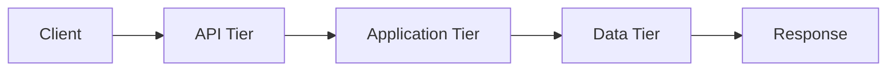

# PMOVES.AI Documentation Standardization Decisions

**Date:** 2026-01-29
**Branch:** PMOVES.AI-Edition-Hardened
**Template Version:** 1.0.0

---

## Overview

This document summarizes the standardization decisions made in creating the PMOVES.AI Standard Documentation Template, ensuring consistency across all documentation while maintaining flexibility for different document types.

---

## Standardization Decisions

### 1. Document Header Section

**Decision:** Include comprehensive metadata at the top of every document

**Rationale:**
- Immediate visibility of document status and version
- Clear ownership and review cycles
- Easy tracking of document lifecycle

**Required Fields:**
```markdown
**Document Type:** [Architecture/Security/Operations/Development/Testing]
**Status:** [Draft/Under Review/Approved/Implemented/Deprecated]
**Version:** X.Y.Z
**Last Updated:** YYYY-MM-DD
**Author:** PMOVES.AI Team
**Review Cycle:** [Monthly/Quarterly/Annually/As-needed]
```

**Pattern Sources:**
- Security-Hardening-Roadmap.md (status/version tracking)
- phase1-security-hardening-index.md (document lifecycle)
- submodules-upstream-audit.md (date/branch tracking)

---

### 2. Architecture Section

**Decision:** Include 5-tier network architecture and 6-tier environment classification

**Rationale:**
- PMOVES.AI implements defense-in-depth via network segmentation
- Services must explicitly declare tier membership
- Clear dependency mapping prevents architectural drift

**Required Elements:**
1. **Network Tier Assignment** (API/Application/Bus/Data/Monitoring)
2. **Communication Matrix** (service-to-service connections)
3. **Data Flow Diagram** (Mermaid format preferred)
4. **Component Dependencies** (upstream/downstream)

**Template Pattern:**
```yaml
# Network tier configuration
networks:
  api_tier:
    driver: bridge
    name: pmoves_api
    ipam:
      config:
        - subnet: 172.30.1.0/24

service-name:
  networks:
    - api_tier       # External access
    - app_tier       # Internal logic
    - monitoring_tier # Metrics exposure
```

**Pattern Sources:**
- network-tier-segmentation.md (5-tier architecture)
- PMOVES.AI Services and Integrations.md (service dependencies)
- CLAUDE.md (production services catalog)

---

### 3. Security Section

**Decision:** Standardize security hardening documentation across all services

**Rationale:**
- Phase 1/2 security hardening established baseline controls
- All services must document security posture
- Consistent format enables security audits

**Required Subsections:**
1. **Container Security** (Dockerfile hardening)
2. **Secrets Management** (rotation, storage, access)
3. **Network Security** (NetworkPolicies, allowed traffic)
4. **Access Control** (authn/authz mechanisms)

**Security Controls Checklist:**
- [ ] Non-root user (UID 65532:65532)
- [ ] Read-only root filesystem
- [ ] Tmpfs mounts for writable paths
- [ ] Capability drops (`cap_drop: ["ALL"]`)
- [ ] No privilege escalation (`no-new-privileges: true`)
- [ ] Minimal base image (prefer distroless)

**Template Pattern:**
```dockerfile
# Standard non-root user pattern
FROM python:3.11-slim

RUN groupadd -r pmoves -g 65532 && \
    useradd -r -u 65532 -g pmoves -s /sbin/nologin -c "PMOVES Service" pmoves && \
    mkdir -p /app /data && \
    chown -R pmoves:pmoves /app /data

# Install as root, switch to non-root
USER pmoves:pmoves
```

**Pattern Sources:**
- Security-Hardening-Roadmap.md (security controls matrix)
- phase1-security-hardening-index.md (container security)
- submodules-upstream-audit.md (security audit criteria)

---

### 4. CI/CD Section

**Decision:** Document GitHub Actions patterns and security scanning requirements

**Rationale:**
- CI/CD pipeline consistency across all services
- Hardened runner pattern prevents supply chain attacks
- Automated security scanning is mandatory

**Required Elements:**
1. **Harden-Runner Configuration** (egress policy, allowed endpoints)
2. **Action Version Pinning** (SHA256 commit hashes)
3. **Multi-Architecture Builds** (amd64, arm64)
4. **Registry Publishing** (GHCR primary, Docker Hub fallback)
5. **SLSA Provenance** (attestation and SBOM)

**CI/CD Requirements:**
| Check | Status | Requirement |
|-------|--------|-------------|
| CodeQL Analysis | ✅/❌ | Must pass |
| CHIT Contract Check | ✅/❌ | Must pass |
| SQL Policy Lint | ✅/❌ | Must pass |
| CodeRabbit Review | ✅/❌ | Docstring coverage ≥80% |
| Trivy Scan | ✅/❌ | Zero CRITICAL CVEs |

**Template Pattern:**
```yaml
# Harden-Runner configuration
- name: Harden Runner
  uses: step-security/harden-runner@v2
  with:
    egress-policy: audit  # Start with audit, move to block
    disable-sudo: true
    disable-file-monitoring: false
    allowed-endpoints: >
      github.com:443
      ghcr.io:443
      registry-1.docker.io:443
```

**Pattern Sources:**
- build-images.yml (multi-arch build matrix)
- codeql.yml (security scanning workflow)
- Security-Hardening-Roadmap.md (SLSA provenance)

---

### 5. Tailscale Section

**Decision:** Include Tailscale VPN configuration for production access

**Rationale:**
- Production access via secure VPN tunnel
- Zero-trust networking for remote administration
- Consistent access pattern across all environments

**Required Elements:**
1. **Tailscale Network Configuration** (subnet routing, ACLs)
2. **Service Exposure** (which services accessible via Tailscale)
3. **Authentication** (SSO integration, key management)
4. **Access Control** (who can access what)

**Template Pattern:**
```bash
# Tailscale installation
curl -fsSL https://tailscale.com/install.sh | sh

# Connect to tailnet
sudo tailscale up --advertise-routes=172.30.0.0/16 --accept-routes

# Verify connection
tailscale status
```

**Pattern Sources:**
- DOCUMENTATION-UPDATE-PLAN.md (Tailscale integration)
- network-tier-segmentation.md (external access patterns)

---

### 6. Submodule Section

**Decision:** Document submodule management and upstream sync patterns

**Rationale:**
- PMOVES.AI uses 20+ forked submodules
- Regular upstream sync required for security patches
- Clear contribution back to upstream process

**Required Elements:**
1. **Upstream Remote** (original repository URL)
2. **Sync Status** (commits behind/ahead)
3. **CI/CD Status** (GitHub Actions health)
4. **Security Hardening** (USER directives, CVE scan)
5. **Upstream PR Candidates** (changes suitable for contributing)

**Audit Workflow:**
```bash
# Add upstream remote
cd <submodule>
git remote add upstream https://github.com/<owner>/<repo>.git
git fetch upstream

# Check sync status
git log --oneline HEAD..upstream/main | wc -l  # behind
git log --oneline upstream/main..HEAD | wc -l  # ahead

# Create sync branch
git checkout -b sync-upstream-$(date +%Y%m%d)
git merge upstream/main
```

**Template Pattern:**
| Parameter | Status | Notes |
|-----------|--------|-------|
| **Upstream** | https://github.com/owner/repo.git | |
| **Upstream Sync** | 19 behind, 3 ahead | Needs sync |
| **CI/CD** | ✅ Passing | Latest run: success |
| **Docker Build** | ✅ Healthy | docker-compose.pmoves.yml present |
| **Security** | ✅ Hardened | USER directives added |

**Pattern Sources:**
- submodules-upstream-audit.md (audit parameters)
- PMOVES_Git_Organization.md (submodule catalog)

---

### 7. Audit Section

**Decision:** Include review checklist and validation criteria

**Rationale:**
- Consistent review process across all documentation
- Clear acceptance criteria
- Automated validation where possible

**Required Elements:**
1. **Pre-Deployment Checklist** (what must be checked before going live)
2. **Validation Criteria** (how to verify successful implementation)
3. **Rollback Plan** (how to revert if issues occur)
4. **Compliance Mapping** (which standards this meets)

**Review Checklist:**
- [ ] All services run as non-root (UID 65532)
- [ ] Read-only root filesystems enabled
- [ ] Network policies applied (default-deny + explicit allow)
- [ ] Secrets stored in Vault/ExternalSecrets
- [ ] Health check endpoint functional
- [ ] Metrics exposed to Prometheus
- [ ] Logs shipping to Loki
- [ ] CI/CD pipeline passing
- [ ] Docstring coverage ≥80%
- [ ] Zero CRITICAL CVEs in Trivy scan

**Compliance Alignment:**
- ✅ **CIS Docker Benchmark 5.3:** Container runtime security
- ✅ **NIST 800-190:** Container security guidelines
- ✅ **Kubernetes Pod Security Standards:** Restricted profile
- ✅ **PCI DSS 1.3:** Network segmentation

**Pattern Sources:**
- testing-strategy.md (pre-PR testing requirements)
- phase1-deployment-guide.md (validation procedures)
- Security-Hardening-Roadmap.md (compliance mapping)

---

## Cross-Reference Patterns

### Internal Links

**Decision:** Use absolute paths for all internal documentation links

**Rationale:**
- Links work regardless of current working directory
- Consistency across all documentation
- Easy to maintain and verify

**Pattern:**
```markdown
- [Network Tier Segmentation](/home/pmoves/PMOVES.AI/docs/architecture/network-tier-segmentation.md)
- [Testing Strategy](/home/pmoves/PMOVES.AI/.claude/context/testing-strategy.md)
- [Services Catalog](/home/pmoves/PMOVES.AI/.claude/context/services-catalog.md)
```

### External Links

**Decision:** Include authoritative external references

**Rationale:**
- Cite industry standards and best practices
- Provide context for PMOVES.AI-specific patterns
- Enable deeper learning

**Required External References:**
- [CIS Docker Benchmark](https://www.cisecurity.org/benchmark/docker)
- [NIST SP 800-190](https://nvlpubs.nist.gov/nistpubs/SpecialPublications/NIST.SP.800-190.pdf)
- [Kubernetes Pod Security Standards](https://kubernetes.io/docs/concepts/security/pod-security-standards/)
- [Dockerfile Best Practices](https://docs.docker.com/develop/develop-images/dockerfile_best-practices/)

---

## Code Block Standards

### Docker Compose Snippets

**Decision:** Use YAML with inline comments for explanation

**Pattern:**
```yaml
services:
  service-name:
    # Security hardening
    user: "65532:65532"  # Non-root user (pmoves:pmoves)
    security_opt:
      - no-new-privileges:true  # Prevent privilege escalation
    cap_drop:
      - ALL  # Drop all Linux capabilities
    read_only: true  # Prevent runtime filesystem modification
    tmpfs:
      - /tmp:size=500M  # Writable temp storage
      - /home/pmoves/.cache:size=1G  # Application cache
```

### Bash Commands

**Decision:** Include command purpose and expected output

**Pattern:**
```bash
# Check service health (should return 200 OK)
curl -f http://localhost:8080/healthz

# Expected output:
# {"status":"healthy","uptime":12345}
```

### API Examples

**Decision:** Show request/response with headers

**Pattern:**
```bash
# Generate embeddings via TensorZero
curl -X POST http://localhost:3030/v1/embeddings \
  -H "Content-Type: application/json" \
  -d '{
    "model": "gemma_embed_local",
    "input": "Text to embed"
  }'

# Response:
# {
#   "object": "list",
#   "data": [{"embedding": [0.1, 0.2, ...]}],
#   "model": "gemma_embed_local"
# }
```

---

## Table Formats

### Service Communication Matrix

**Decision:** Use consistent column headers for communication tables

**Pattern:**
| From Service | To Service | Protocol | Port | Purpose |
|-------------|-----------|----------|------|---------|
| agent-zero | hi-rag-gateway-v2 | HTTP/REST | 8086 | Knowledge retrieval |
| hi-rag-gateway-v2 | qdrant | HTTP/gRPC | 6333 | Vector queries |

### Environment Variables

**Decision:** Include required/optional flag and defaults

**Pattern:**
| Variable | Required | Default | Description |
|----------|----------|---------|-------------|
| SERVICE_PORT | Yes | 8080 | HTTP API port |
| LOG_LEVEL | No | INFO | Logging level (DEBUG/INFO/WARNING/ERROR) |
| MAX_WORKERS | No | 4 | Worker thread count |

### CI/CD Requirements

**Decision:** Show status and requirement for each check

**Pattern:**
| Check | Status | Requirement |
|-------|--------|-------------|
| CodeQL Analysis | ✅/❌ | Must pass |
| CHIT Contract Check | ✅/❌ | Must pass |
| CodeRabbit Review | ✅/❌ | Docstring coverage ≥80% |

---

## Version Tracking

### Decision: Semantic versioning for all documents

**Pattern:**
- **Major (X):** Breaking changes, complete rewrites
- **Minor (Y):** New sections, significant additions
- **Patch (Z):** Typos, minor clarifications, link fixes

**Example:**
| Version | Date | Changes |
|---------|------|---------|
| 1.0.0 | 2025-01-29 | Initial version |
| 1.1.0 | 2025-02-15 | Added CI/CD section |
| 1.1.1 | 2025-02-20 | Fixed typo in security section |
| 2.0.0 | 2025-03-10 | Restructured entire document |

---

## Diagram Standards

### Decision: Use Mermaid for all diagrams

**Rationale:**
- Text-based (version control friendly)
- Renders in GitHub and many Markdown viewers
- Consistent syntax across all documentation

**Supported Diagram Types:**
1. **Flowcharts** (graph LR/TD)
2. **Sequence Diagrams** (sequenceDiagram)
3. **Gantt Charts** (gantt)
4. **Entity Relationship** (erDiagram)
5. **User Journey** (journey)

**Example:**


---

## Accessibility & Usability

### Decision: Follow WCAG 2.1 guidelines for documentation

**Required Elements:**
- [ ] Descriptive link text (not "click here")
- [ ] Proper heading hierarchy (h1 → h2 → h3)
- [ ] Alt text for diagrams and images
- [ ] Tables with proper headers
- [ ] Code blocks with language specified
- [ ] Color contrast ratios ≥4.5:1

---

## Maintenance

### Decision: Document review cycle based on type

| Document Type | Review Cycle | Trigger |
|--------------|--------------|---------|
| Architecture | Quarterly | Major infrastructure changes |
| Security | Monthly | New vulnerabilities, security incidents |
| Operations | Monthly | Service degradation, incidents |
| Development | As-needed | Feature additions, API changes |
| Testing | As-needed | New test requirements |

### Decision: Owner assignment for each document

**Roles:**
- **Technical Lead:** Architecture, Development documents
- **Security Lead:** Security, Audit documents
- **Operations Lead:** Operations, Troubleshooting documents
- **QA Lead:** Testing, Validation documents

---

## Compliance Mapping

### Decision: Explicitly reference compliance standards

**Standards Covered:**
- ✅ **CIS Docker Benchmark:** Section 5 (Container Runtime)
- ✅ **NIST SP 800-190:** Container Security Guide
- ✅ **Kubernetes Pod Security Standards:** Restricted profile
- ✅ **PCI DSS Requirement 1.3:** Network segmentation
- ✅ **SOC 2 CC6.6:** Logical access controls

**Documentation Format:**
```markdown
## Compliance Alignment

This implementation helps PMOVES.AI achieve compliance with:

- ✅ **CIS Docker Benchmark 5.3:** Non-root container execution
- ✅ **NIST 800-190:** Read-only filesystems
- ✅ **Kubernetes Pod Security Standards:** Restricted profile enforced
```

---

## Template Location & Usage

### Template File
**Path:** `/home/pmoves/PMOVES.AI/docs/templates/STANDARD-DOCUMENTATION-TEMPLATE.md`

### Usage Instructions

1. **Copy Template:**
   ```bash
   cp /home/pmoves/PMOVES.AI/docs/templates/STANDARD-DOCUMENTATION-TEMPLATE.md \
      /home/pmoves/PMOVES.AI/docs/my-new-document.md
   ```

2. **Fill in Metadata:**
   - Update document type, status, version
   - Set author and review cycle
   - Add specific objectives

3. **Customize Sections:**
   - Keep relevant sections (Architecture, Security, etc.)
   - Remove irrelevant sections
   - Add service-specific content

4. **Update Links:**
   - Replace `#link` placeholders with actual paths
   - Verify all internal links work
   - Add external references as needed

5. **Review & Approve:**
   - Self-review against checklist
   - Request peer review
   - Update status to "Approved"

---

## Success Criteria

Template standardization is successful when:

- [ ] 90%+ of new documentation uses the template
- [ ] Peer review time reduced by 50% (consistent format)
- [ ] All documentation passes accessibility checks
- [ ] Zero broken internal links (absolute paths)
- [ ] Security sections complete for all services
- [ ] CI/CD sections accurate for all workflows
- [ ] Compliance mapping explicit in all relevant docs

---

**Document Version:** 1.0.0
**Last Updated:** 2026-01-29
**Next Review:** 2026-04-29
**Maintainer:** PMOVES.AI Documentation Team
